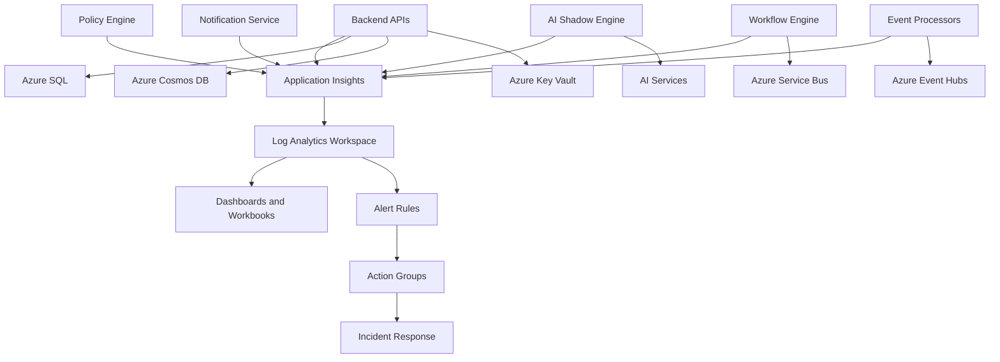

# Azure Application Insights

## Purpose

Azure Application Insights is Microsoft's Application Performance Monitoring (APM) service for collecting application telemetry, request traces, dependency calls, exceptions, custom events, metrics, and distributed traces. It is part of Azure Monitor and provides deep visibility into application behavior, performance, reliability, and user-facing service health.

Within the Otic Fortress AI Governance and Cybersecurity Platform, Application Insights provides the primary application observability layer for backend APIs, AI services, workflow processors, event consumers, policy engines, and operational services. It helps engineering and SRE teams understand how requests move through the platform, where failures occur, which dependencies are slow, and how AI governance workflows behave in production.

Application Insights is essential for Fortress because the platform depends on distributed microservices, event-driven processing, AI inference, policy evaluation, and security analytics. These workloads require end-to-end visibility across services, dependencies, queues, event streams, databases, and AI components.

---

## Why Fortress Uses Azure Application Insights

Fortress uses Application Insights to monitor application behavior, diagnose failures, and measure reliability across the control plane and data plane.

Primary use cases include:

- **Backend API monitoring:** Track request rate, latency, response codes, exceptions, and dependency performance.
- **AI Shadow Engine observability:** Monitor AI detections, analysis latency, risk scoring, model calls, and processing failures.
- **Policy Engine monitoring:** Measure policy evaluation latency, policy violations, decision outcomes, and enforcement errors.
- **Workflow processing:** Trace workflow execution, retries, state transitions, and background job failures.
- **Event consumer monitoring:** Observe Event Hubs and Service Bus consumers, processing latency, checkpoint behavior, and downstream failures.
- **Dependency tracking:** Correlate calls to Azure SQL, Cosmos DB, Service Bus, Event Hubs, Key Vault, external APIs, and AI services.
- **Distributed tracing:** Follow a request or event across multiple services using correlation identifiers and trace context.
- **Reliability engineering:** Measure SLOs, error rates, dependency failures, and performance regressions.
- **AI governance telemetry:** Capture custom events for AI usage, policy decisions, shadow AI detections, prompt risk, and model behavior.
- **Incident response:** Provide detailed telemetry for root cause analysis, impact assessment, and post-incident review.

Application Insights complements Azure Monitor and Log Analytics by focusing on application-level telemetry. Azure Monitor provides platform metrics and diagnostic signals, Log Analytics centralizes query and retention, and Application Insights provides application performance, tracing, and dependency visibility.

---

## Proposed Naming Convention

Proposed Application Insights resource names:

```text
appi-otic-fortress-dev
appi-otic-fortress-test
appi-otic-fortress-prod
```

Proposed logical application role names:

```text
fortress-api-gateway
fortress-backend-api
fortress-ai-shadow-engine
fortress-policy-engine
fortress-workflow-engine
fortress-notification-service
fortress-event-processor
```

Proposed custom telemetry event names:

```text
AIInferenceCompleted
AIShadowDetected
AIPolicyViolation
PolicyEvaluationCompleted
WorkflowStepCompleted
SecurityEventProcessed
```

Application Insights naming convention format:

```text
appi-<platform-name>-<environment>
```

Application role naming convention format:

```text
<platform-name>-<service-name>
```

Custom event naming convention format:

```text
<Domain><Action><Outcome>
```

- `appi`: Identifies the resource as Azure Application Insights.
- `otic-fortress`: Identifies the platform or workload.
- `dev`, `test`, `prod`: Identifies the target environment.
- Application role names identify the emitting service in traces, logs, dependencies, and dashboards.
- Custom event names should be readable, stable, and aligned with platform domains such as AI, policy, workflow, security, and audit.

This convention supports clear ownership, environment separation, telemetry correlation, dashboard filtering, alert routing, and operational troubleshooting.

---

## Application Monitoring Architecture

Fortress should use Application Insights as the APM layer within the broader Azure Monitor architecture.



Applications emit telemetry to Application Insights. Application Insights captures requests, dependencies, exceptions, traces, metrics, and custom events. Telemetry is stored in a Log Analytics Workspace, queried with KQL, visualized through dashboards and workbooks, and used by alert rules for incident response.

---

## Telemetry Collection Strategy

Application Insights should collect both automatic telemetry and Fortress-specific custom telemetry.

| Telemetry Type | Purpose |
| --- | --- |
| Requests | Track API calls, HTTP operations, status codes, duration, and success rate. |
| Dependencies | Track calls to databases, messaging systems, external APIs, AI services, and platform dependencies. |
| Exceptions | Capture unhandled exceptions, stack traces, failure context, and affected operations. |
| Traces | Store structured application logs with severity, correlation identifiers, and service context. |
| Custom Events | Capture domain-specific events such as AI detections, policy decisions, workflow transitions, and security processing. |
| Custom Metrics | Track business and platform metrics such as inference latency, token usage, policy violations, workflow duration, and event processing lag. |
| Availability Tests | Monitor public or internal endpoint availability where appropriate. |
| Performance Counters | Capture runtime and process-level performance signals where supported. |

Telemetry should be consistent across services so that SREs can compare behavior, correlate failures, and identify platform-wide patterns.

---

## Instrumentation Strategy

Fortress services should be instrumented using supported Azure Monitor and Application Insights patterns. Where possible, OpenTelemetry-compatible instrumentation should be preferred so telemetry can remain portable, standardized, and consistent across languages and hosting platforms.

Recommended instrumentation patterns:

- Use Application Insights or Azure Monitor OpenTelemetry instrumentation for backend services.
- Set a stable cloud role name for each service.
- Include correlation identifiers in requests, traces, custom events, and background jobs.
- Track dependencies for Azure SQL, Cosmos DB, Service Bus, Event Hubs, Key Vault, AI services, and external APIs.
- Emit custom events for AI governance, policy enforcement, security analytics, workflow execution, and incident response.
- Emit custom metrics for SLOs, token usage, AI inference latency, event processing latency, and policy evaluation latency.
- Use structured logging with consistent field names.
- Avoid logging secrets, credentials, tokens, raw private keys, or unnecessary sensitive data.

Instrumentation should be validated as part of release readiness. New services should not be considered production-ready until they emit useful request, dependency, exception, trace, metric, and custom event telemetry.

---

## Distributed Tracing and Correlation

Distributed tracing allows Fortress teams to follow activity across services, dependencies, and event-driven workflows. This is critical because a single user action or AI governance event may flow through APIs, Service Bus queues, Event Hubs streams, Cosmos DB, Azure SQL, Key Vault, and AI services.

Correlation requirements:

- Every inbound request should receive or preserve a correlation identifier.
- Background jobs should preserve the originating correlation identifier where available.
- Service Bus messages should include correlation identifiers and operation context.
- Event Hubs events should include correlation identifiers, tenant context, and event identifiers.
- AI inference operations should include model name, tenant context, operation name, and safe governance metadata.
- Logs, traces, dependencies, and custom events should use the same correlation context.

Correlation makes it possible to reconstruct incidents, measure end-to-end latency, identify failed dependencies, and support audit investigations.

---

## Metrics Strategy

Application Insights metrics should support reliability, performance, AI governance, and operational excellence.

| Metric Category | Example Metrics | Purpose |
| --- | --- | --- |
| API Performance | Request rate, P50 latency, P95 latency, P99 latency, response codes | Measure user-facing performance and availability. |
| Reliability | Error rate, exception count, failed dependencies, retry count | Detect failures and regressions. |
| Dependency Health | SQL latency, Cosmos DB latency, Service Bus failures, Event Hubs failures, Key Vault failures | Identify downstream bottlenecks and outages. |
| AI Workloads | Token usage, inference latency, model errors, hallucination rate, prompt risk events | Monitor AI performance, safety, and cost. |
| AI Governance | Policy violations, blocked requests, approval triggers, AI shadow detections | Track governance outcomes and risk signals. |
| Workflow Processing | Workflow duration, step failures, retries, queue processing time | Measure background process reliability. |
| Event Processing | Event processing latency, consumer failures, checkpoint delay, batch size | Monitor event-driven processing. |

Metrics should be used to define alert thresholds, dashboards, SLOs, and capacity planning baselines.

---

## Custom Telemetry Strategy

Fortress should define custom events and metrics for platform-specific governance and cybersecurity workflows.

| Custom Telemetry | Purpose |
| --- | --- |
| `AIInferenceCompleted` | Records AI inference completion, latency, token usage, model name, and outcome. |
| `AIShadowDetected` | Records shadow AI detection events, risk score, tenant context, and detection source. |
| `AIPolicyViolation` | Records AI policy violations, policy identifier, severity, action taken, and correlation ID. |
| `PolicyEvaluationCompleted` | Records policy evaluation latency, result, policy version, and enforcement decision. |
| `WorkflowStepCompleted` | Records workflow step execution, duration, status, and retry count. |
| `SecurityEventProcessed` | Records security event processing outcome, severity, enrichment status, and downstream action. |
| `NotificationDeliveryAttempted` | Records notification channel, delivery status, provider latency, and failure reason. |

Custom telemetry should avoid storing raw sensitive values. AI prompts, model outputs, security payloads, and user content should be minimized, classified, redacted, or tokenized according to Fortress data protection requirements.

---

## Logging Strategy

Application logs should be structured, consistent, and queryable. Logs should support debugging, incident response, security investigation, compliance reporting, and performance analysis.

Recommended fields:

| Field | Purpose |
| --- | --- |
| `timestamp` | Time the telemetry event occurred. |
| `severity` | Log severity such as Information, Warning, Error, or Critical. |
| `serviceName` | Name of the emitting Fortress service. |
| `environment` | Development, Testing, or Production. |
| `tenantId` | Tenant or organization context where approved. |
| `correlationId` | End-to-end trace identifier. |
| `operationName` | Logical operation being performed. |
| `eventType` | Domain event or telemetry category. |
| `outcome` | Success, failure, blocked, skipped, or retried. |
| `durationMs` | Operation duration where applicable. |

Logs should be centralized in the workspace-backed Application Insights resource and made available through Log Analytics queries, dashboards, and alert rules.

---

## Sampling and Cost Management

Application Insights telemetry volume should be managed carefully so that observability remains useful and cost-effective.

- Use sampling for high-volume request, trace, and dependency telemetry where appropriate.
- Preserve critical errors, exceptions, security events, policy violations, and AI governance events.
- Avoid excessive verbose logging in production.
- Review ingestion volume by service and telemetry type.
- Use retention policies aligned with environment and data classification.
- Use custom metrics for high-cardinality operational trends instead of logging excessive event detail.
- Monitor telemetry ingestion costs through Azure Cost Management and Log Analytics usage views.

Sampling must not remove the telemetry needed for security investigations, audit evidence, incident response, or SLO measurement.

---

## Availability and SLO Monitoring

Application Insights should support SLO measurement for critical Fortress services.

| Service Area | SLO Signal | Measurement |
| --- | --- | --- |
| API Gateway | Availability and request latency | Request success rate and P95 duration. |
| Backend APIs | Error rate and dependency health | Failed requests, exceptions, and dependency failures. |
| AI Shadow Engine | Detection processing latency | Custom events and custom metrics. |
| Policy Engine | Policy evaluation latency | Policy evaluation telemetry and request duration. |
| Workflow Engine | Workflow completion reliability | Custom workflow events, exceptions, and dependency calls. |
| Event Processors | Processing latency and failure rate | Custom metrics, dependency telemetry, and traces. |
| AI Services | Inference latency and model errors | Dependency telemetry and custom AI metrics. |

Application Insights telemetry should feed SLO dashboards, alert rules, error budget analysis, and post-incident reviews.

---

## KQL Examples

### API Error Rate

```kql
requests
| where timestamp > ago(30m)
| summarize TotalRequests = count(), FailedRequests = countif(success == false) by operation_Name
| extend ErrorRate = todouble(FailedRequests) / todouble(TotalRequests) * 100
| where ErrorRate > 1
| order by ErrorRate desc
```

### API Latency

```kql
requests
| where timestamp > ago(1h)
| summarize P50 = percentile(duration, 50), P95 = percentile(duration, 95), P99 = percentile(duration, 99) by operation_Name, bin(timestamp, 5m)
| order by timestamp desc
```

### Failed Dependencies

```kql
dependencies
| where timestamp > ago(1h)
| where success == false
| summarize Failures = count() by type, target, operation_Name
| order by Failures desc
```

### Dependency Latency

```kql
dependencies
| where timestamp > ago(1h)
| summarize P95 = percentile(duration, 95), Failures = countif(success == false) by type, target
| order by P95 desc
```

### Exceptions by Service

```kql
exceptions
| where timestamp > ago(24h)
| summarize ExceptionCount = count() by cloud_RoleName, type, outerMessage
| order by ExceptionCount desc
```

### Correlated Request Trace

```kql
union requests, dependencies, traces, exceptions, customEvents
| where timestamp > ago(24h)
| where operation_Id == "<operation-id>"
| project timestamp, itemType, cloud_RoleName, operation_Name, name, message, success, duration
| order by timestamp asc
```

### AI Governance Events

```kql
customEvents
| where timestamp > ago(24h)
| where name in ("AIShadowDetected", "AIPolicyViolation", "PolicyEvaluationCompleted")
| extend TenantId = tostring(customDimensions.tenantId)
| extend Severity = tostring(customDimensions.severity)
| summarize Events = count() by name, TenantId, Severity, bin(timestamp, 1h)
| order by timestamp desc
```

### AI Inference Latency

```kql
customMetrics
| where timestamp > ago(1h)
| where name == "AIInferenceLatencyMs"
| summarize P50 = percentile(value, 50), P95 = percentile(value, 95), P99 = percentile(value, 99) by bin(timestamp, 5m)
| order by timestamp desc
```

---

## Dashboards and Workbooks

Application Insights should support operational dashboards and Azure Workbooks for service owners, SREs, security teams, and leadership.

Recommended views:

- **API Health:** Request rate, latency, error rate, failed operations, and dependency failures.
- **Dependency Health:** Azure SQL, Cosmos DB, Service Bus, Event Hubs, Key Vault, AI services, and external API latency.
- **AI Operations:** Inference latency, token usage, model failures, AI Shadow detections, policy violations, and prompt risk events.
- **Workflow Reliability:** Workflow completions, failures, retries, queue processing time, and background job duration.
- **Security Signals:** Authentication failures, policy violations, suspicious activity, and security event processing.
- **SLO Dashboard:** Availability, latency, error rate, AI inference performance, policy evaluation latency, and event processing latency.

Dashboards should be environment-specific and should include production-focused views for critical services.

---

## Alerting Strategy

Application Insights alerting should focus on actionable application-level signals.

| Alert | Severity | Signal | Response |
| --- | --- | --- | --- |
| API High Error Rate | Critical | Failed request rate exceeds approved threshold | Investigate recent deployments, API exceptions, and dependency failures. |
| API High Latency | Warning | P95 latency exceeds SLO | Review dependency latency, resource pressure, and traffic patterns. |
| Dependency Failure Spike | Critical | Failed dependency calls increase sharply | Identify affected dependency and validate downstream service health. |
| Exception Spike | Warning | Exception count exceeds baseline | Review exception type, affected service, and recent code changes. |
| AI Inference Latency High | Warning | P95 inference latency exceeds target | Review AI service dependency, model usage, retries, and capacity. |
| AI Policy Violations Spike | Critical | Policy violation custom events exceed baseline | Investigate tenant activity, policy changes, and security response needs. |
| Event Processor Failures | Critical | Consumer exceptions or processing failures increase | Review Event Hubs or Service Bus processing, checkpointing, and downstream dependencies. |
| Telemetry Drop | Warning | Expected service telemetry stops arriving | Verify service health, instrumentation, network access, and telemetry configuration. |

Critical alerts should route to on-call response through approved action groups. Warning alerts should route to operational channels for triage. Informational alerts should support review, trend tracking, and operational awareness.

---

## Security

Application Insights telemetry may contain operational, security, tenant, and AI governance data. Access and data handling must follow enterprise security standards.

- **Microsoft Entra ID:** Provides identity-based access to Application Insights and related monitoring resources.
- **RBAC:** Controls who can read telemetry, manage alert rules, edit dashboards, or administer monitoring settings.
- **Managed Identity:** Allows Azure-hosted workloads and automation to interact with monitoring resources without hardcoded credentials.
- **Log Analytics Workspace Access Control:** Restricts access to centralized telemetry according to role and environment.
- **Private Networking:** Should be used for dependent platform services where required by the overall network architecture.
- **Data Redaction:** Prevents secrets, credentials, tokens, raw prompts, and sensitive payloads from being stored in telemetry.
- **Diagnostic Logs:** Track management operations and access patterns for monitoring resources.
- **Azure Policy:** Enforces monitoring configuration, diagnostic settings, retention requirements, and governance controls.

Production Application Insights access should be limited to approved operators, SREs, security teams, and service owners. Access should be reviewed regularly.

---

## Environment Separation

Development, Testing, and Production should each have separate Application Insights resources.

Environment separation provides:

- **Security isolation:** Prevents non-production users and services from accessing production telemetry.
- **Operational safety:** Prevents development or testing activity from polluting production dashboards and alerts.
- **Retention control:** Allows production telemetry to follow stricter retention requirements.
- **Cost management:** Enables telemetry ingestion and retention costs to be measured by environment.
- **Release validation:** Allows instrumentation, dashboards, and alerts to be validated before production rollout.
- **Data protection:** Prevents production AI telemetry, security events, and user activity from leaking into lower environments.

Production telemetry should not be copied into non-production environments unless approved, sanitized, and governed by data protection requirements.

---

## Security Best Practices

- Apply least privilege access to Application Insights and Log Analytics telemetry.
- Use Microsoft Entra ID and RBAC for operators, service owners, and automation identities.
- Prefer managed identity for Azure-hosted workloads and automation.
- Do not store instrumentation keys, connection strings, or secrets directly in source code.
- Store required configuration secrets in Azure Key Vault.
- Avoid logging credentials, tokens, secrets, private keys, or unnecessary sensitive data.
- Redact or classify AI prompts, model outputs, and security payloads before telemetry ingestion.
- Enable diagnostic logs and monitor access to production telemetry.
- Use separate Application Insights resources for each environment.
- Review sampling, retention, access control, and alert rules regularly.
- Preserve critical security, audit, exception, and AI governance telemetry.

---

## Ownership Matrix

| Area | Owner |
|------|-------|
| Application Insights | Cloud Infrastructure & DevOps |
| API Instrumentation | Backend Team |
| AI Telemetry | AI Shadow Team |
| Dashboards | SRE Team |
| Alert Rules | DevOps |
| KQL Queries | Platform Engineering |

## Future Integration

Application Insights will integrate with several Fortress platform components:

- **Backend APIs:** Monitor request performance, failures, dependencies, and user-facing API behavior.
- **Azure Kubernetes Service (AKS):** Capture telemetry from containerized microservices and correlate with cluster health.
- **Azure Monitor:** Provide platform metrics, alert rules, dashboards, and centralized observability.
- **Log Analytics Workspace:** Store and query Application Insights telemetry using KQL.
- **Azure SQL:** Track dependency calls, query latency patterns, failures, and application-level database impact.
- **Azure Cosmos DB:** Track request latency, dependency failures, throttling impact, and data access patterns.
- **Azure Service Bus:** Trace workflow processing, message handling, retries, and dead-letter-related failures.
- **Azure Event Hubs:** Trace event processing, consumer behavior, ingestion workflows, and downstream processing latency.
- **Azure Key Vault:** Track secret retrieval failures, dependency latency, and identity-related access issues.
- **AI Shadow Engine:** Monitor AI detection processing, inference calls, policy outcomes, and risk scoring.
- **Security Analytics:** Correlate application events, policy violations, exceptions, and security telemetry.
- **Microsoft Sentinel:** Support future SIEM integration for security monitoring, incident investigation, and threat hunting.

Application Insights should remain tightly integrated with the Fortress monitoring strategy so application telemetry can be correlated with infrastructure, data, messaging, streaming, security, and AI governance signals.

---

## Summary

Azure Application Insights provides the Application Performance Monitoring foundation for the Otic Fortress AI Governance and Cybersecurity Platform. It captures requests, dependencies, exceptions, traces, custom events, metrics, and distributed traces across backend services, AI workloads, event processors, policy engines, and workflow services.

By combining Application Insights with Azure Monitor, Log Analytics, structured telemetry, distributed tracing, custom AI governance events, RBAC, managed identity, environment separation, dashboards, KQL, and alerting, Fortress gains the application-level visibility required for reliability engineering, incident response, security operations, governance, and continuous platform improvement.
