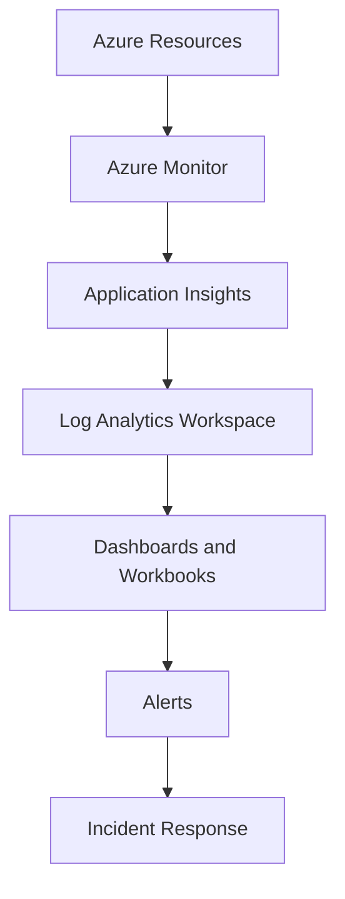

# Monitoring & Observability Architecture

## Purpose

Monitoring and observability provide the operational visibility layer for the Otic Fortress AI Governance and Cybersecurity Platform. They allow engineering, security, and operations teams to understand system health, application behavior, infrastructure performance, AI workload activity, and security posture across cloud environments.

Observability is essential for Fortress because the platform operates across distributed services, AI processing components, event-driven workflows, cloud infrastructure, and cybersecurity telemetry pipelines. The platform must detect failures quickly, trace requests across services, measure reliability, identify abnormal behavior, and preserve evidence for audit and compliance.

For AI governance and cybersecurity workloads, monitoring is not only an operational concern. It is also a governance control. Fortress must observe AI agent behavior, policy violations, event processing delays, unauthorized activity, infrastructure health, and security signals in near real time.

---

## Objectives

The Fortress monitoring platform is designed to support the following objectives:

- **High Availability:** Detect service outages, resource failures, and dependency issues before they create prolonged customer impact.
- **Reliability:** Measure error rates, latency, retries, backlogs, and processing delays across the control plane and data plane.
- **Security Visibility:** Monitor authentication events, access failures, policy violations, suspicious activity, and security telemetry.
- **Performance Monitoring:** Track application latency, throughput, resource usage, query performance, and AI inference performance.
- **Cost Monitoring:** Provide visibility into resource consumption, throughput usage, token usage, storage growth, and scaling behavior.
- **Compliance:** Preserve operational logs, audit events, diagnostic records, and evidence needed for governance and regulatory requirements.
- **Operational Excellence:** Enable dashboards, alerting, incident response, root cause analysis, trend analysis, and continuous improvement.

---

## Scope

This document covers monitoring and observability for the following Fortress platform components:

- Azure Kubernetes Service (AKS)
- Azure SQL Database
- Azure Cosmos DB
- Azure Service Bus
- Azure Event Hubs
- Azure Key Vault
- Backend APIs
- AI Shadow Engine
- AI Services
- Cloud infrastructure
- Security events and controls
- GitHub Actions pipelines

Monitoring should be implemented consistently across Development, Testing, and Production environments, with production receiving stricter alerting, retention, security controls, and operational response procedures.

---

## Proposed Naming Convention

Proposed Azure Monitor logical scope names:

```text
monitor-otic-fortress-dev
monitor-otic-fortress-test
monitor-otic-fortress-prod
```

Proposed Log Analytics Workspace names:

```text
law-otic-fortress-dev
law-otic-fortress-test
law-otic-fortress-prod
```

Proposed Application Insights names:

```text
appi-otic-fortress-dev
appi-otic-fortress-test
appi-otic-fortress-prod
```

Proposed dashboard names:

```text
dash-otic-fortress-platform-dev
dash-otic-fortress-platform-test
dash-otic-fortress-platform-prod
```

Proposed alert rule names:

```text
alert-otic-fortress-api-error-rate-prod
alert-otic-fortress-aks-cpu-prod
alert-otic-fortress-eventhub-throttling-prod
alert-otic-fortress-servicebus-deadletter-prod
```

Naming convention formats:

```text
monitor-<platform-name>-<environment>
law-<platform-name>-<environment>
appi-<platform-name>-<environment>
dash-<platform-name>-<dashboard-purpose>-<environment>
alert-<platform-name>-<signal>-<environment>
```

- `monitor`: Identifies the logical monitoring scope for an environment.
- `law`: Identifies the resource as a Log Analytics Workspace.
- `appi`: Identifies the resource as an Application Insights instance.
- `dash`: Identifies an Azure dashboard or workbook view.
- `alert`: Identifies an alert rule.
- `otic-fortress`: Identifies the platform or workload.
- `dev`, `test`, `prod`: Identifies the target environment.

Azure Monitor is a platform service rather than a single application resource. The `monitor-*` convention should be used as the logical naming standard for monitoring scopes, dashboards, action groups, workbooks, documentation, and tagging.

---

## Architecture Overview

Fortress observability is built on Azure Monitor, Application Insights, Log Analytics, dashboards, alert rules, and incident response workflows. Azure resources emit platform metrics and diagnostic logs. Applications emit traces, requests, dependencies, exceptions, and custom telemetry. Logs and metrics are centralized in Log Analytics and surfaced through dashboards, workbooks, and alert rules.



Azure Monitor provides the platform collection layer. Application Insights provides application performance monitoring and distributed tracing. Log Analytics provides centralized query and retention. Dashboards and workbooks provide operational visibility. Alerts and action groups drive incident response, escalation, and remediation.

---

## Monitoring Components

### Azure Monitor

Azure Monitor is the central Azure observability service for collecting, analyzing, and alerting on metrics, logs, resource health, and diagnostic data. Fortress uses Azure Monitor to capture health and performance signals from AKS, Azure SQL, Cosmos DB, Service Bus, Event Hubs, Key Vault, and supporting infrastructure.

### Application Insights

Application Insights provides application performance monitoring for Fortress backend services, APIs, AI services, and workflow processors. It captures request telemetry, dependency calls, exceptions, traces, performance counters, distributed traces, and custom events.

Application Insights should be used to correlate user requests, API calls, AI inference operations, policy evaluations, event processing, and downstream dependency behavior.

### Log Analytics Workspace

Log Analytics Workspace provides centralized storage, query, analysis, and retention for monitoring data. Fortress uses Log Analytics to support KQL queries, dashboards, operational investigations, compliance reporting, security analysis, and incident response.

Each environment should have a separate workspace with retention settings aligned to business, compliance, and cost requirements.

### Diagnostic Settings

Diagnostic settings route platform logs and metrics from Azure resources into approved destinations such as Log Analytics, Storage, Event Hubs, or Microsoft Sentinel. Fortress resources should enable diagnostic settings for production workloads and other environments where operational analysis is required.

### Azure Workbooks

Azure Workbooks provide interactive reporting and visualization for metrics, logs, and operational data. Fortress should use workbooks for platform health, AI operations, security operations, event streaming, messaging reliability, and executive reporting.

### Dashboards

Dashboards provide quick operational views for service owners, SREs, security analysts, and leadership. Dashboards should show availability, latency, error rates, throughput, queue depth, event ingestion, AI telemetry, cost indicators, and active incidents.

### Alert Rules

Alert rules detect conditions that require attention, investigation, escalation, or automated response. Fortress should define alerts for availability, latency, failures, throttling, dead-letter messages, consumer lag, resource exhaustion, security events, and AI governance signals.

### Action Groups

Action groups define the notification and response targets for alert rules. Fortress action groups may include email, Slack, PagerDuty, webhook integrations, ITSM systems, and auto-remediation workflows.

---

## Metrics Collection

### Infrastructure Metrics

| Area | Metrics | Purpose |
| --- | --- | --- |
| AKS Nodes | CPU, memory, disk, node readiness, node count | Detect resource pressure, failed nodes, and capacity constraints. |
| AKS Pods | CPU, memory, restarts, pending pods, failed pods | Detect workload instability and scheduling issues. |
| Networking | Ingress, egress, connection count, failed connections | Monitor connectivity and traffic patterns. |
| Storage | Transactions, latency, capacity, availability | Track storage performance and growth. |
| Infrastructure Health | Resource health, availability, service health | Identify platform-level Azure issues and resource failures. |

### Application Metrics

| Area | Metrics | Purpose |
| --- | --- | --- |
| Backend APIs | Request rate, latency, error rate, dependency latency | Measure API health and user-facing performance. |
| API Gateway | Throughput, 4xx rate, 5xx rate, P95 latency | Detect routing, authentication, or downstream service issues. |
| Policy Engine | Policy evaluations, violations, evaluation latency, failures | Monitor policy enforcement and governance decisions. |
| Workflow Engine | Workflow starts, completions, failures, retries, duration | Track background orchestration reliability. |
| Notification Service | Delivery rate, failure rate, retry count, provider latency | Monitor user and operational notification delivery. |

### AI Workload Metrics

| Area | Metrics | Purpose |
| --- | --- | --- |
| AI Shadow Engine | Shadow detections, risk score distribution, policy violations | Monitor unauthorized or risky AI activity. |
| AI Services | Token usage, inference latency, request count, model errors | Track AI service performance, reliability, and cost. |
| Model Evaluation | Hallucination rate, confidence score, classification accuracy | Measure AI governance quality and model risk. |
| Prompt Processing | Prompt volume, blocked prompts, sensitive data detections | Monitor prompt safety and policy controls. |
| Agent Telemetry | Agent actions, tool calls, failure rate, execution duration | Observe autonomous AI agent behavior and reliability. |

### Azure Resource Metrics

| Azure Resource | Metrics | Purpose |
| --- | --- | --- |
| Azure SQL | DTUs or vCore utilization, connections, deadlocks, query latency | Monitor relational database performance and reliability. |
| Azure Cosmos DB | RU/s, throttling, request latency, storage, availability | Monitor NoSQL throughput, partition pressure, and latency. |
| Azure Service Bus | Queue length, dead-letter count, message age, active messages | Monitor control-plane workflow reliability. |
| Azure Event Hubs | Ingress rate, egress rate, throughput, throttling, consumer lag | Monitor data-plane streaming health. |
| Azure Key Vault | Secret access, failed requests, throttling, latency | Monitor secret access and security-sensitive operations. |

---

## Logging Strategy

### Structured Logging

Fortress services should emit structured logs with consistent fields such as timestamp, severity, service name, environment, tenant identifier, correlation identifier, operation name, event type, and outcome.

### Centralized Logging

Application logs, infrastructure logs, diagnostic logs, security events, and AI telemetry should be centralized in Log Analytics or approved downstream systems. Centralization supports investigation, correlation, reporting, compliance, and incident response.

### Correlation IDs

Every user request, workflow, event, approval, incident, policy evaluation, and AI inference should include a correlation identifier. Correlation IDs allow teams to trace activity across APIs, Service Bus, Event Hubs, databases, AI services, and background processors.

### Distributed Tracing

Distributed tracing should capture request flow across microservices, dependencies, messaging systems, databases, and AI services. Tracing should make it possible to identify slow dependencies, failed service calls, retry behavior, and processing bottlenecks.

### Retention Policies

Retention should be defined by environment and data classification. Production logs should have longer retention than development and testing logs. Audit, security, and compliance logs should follow regulatory and enterprise governance requirements.

### Sensitive Data Handling

Logs must not contain secrets, access tokens, passwords, private keys, raw credentials, or unnecessary sensitive data. AI prompts, model outputs, user content, and security events should be classified and redacted according to Fortress data protection requirements.

---

## Alerting Strategy

Alerting should focus on actionable signals that indicate customer impact, security risk, reliability degradation, or operational failure. Alerts should include severity, affected service, environment, resource, signal, threshold, owner, and response guidance.

### Severity Levels

| Severity | Description | Expected Response |
| --- | --- | --- |
| Critical | Active outage, severe security issue, data loss risk, or major production impact. | Immediate investigation and escalation to on-call responders. |
| Warning | Degraded performance, rising failure rate, capacity pressure, or delayed processing. | Triage during active support hours or according to on-call policy. |
| Information | Operational event, deployment signal, policy notice, or non-urgent anomaly. | Review through dashboards, work items, or scheduled operations. |

### Alert Matrix

| Alert | Severity | Condition | Action Group | Response |
| --- | --- | --- | --- | --- |
| API High Error Rate | Critical | 5xx error rate exceeds approved threshold for 5 minutes | PagerDuty, Slack, Email | Investigate API, dependencies, recent deployments, and infrastructure health. |
| API High Latency | Warning | P95 latency exceeds SLO for 10 minutes | Slack, Email | Review dependencies, database latency, resource usage, and traffic patterns. |
| AKS Node Not Ready | Critical | One or more production nodes are unavailable | PagerDuty, Slack | Investigate cluster health, node events, and workload scheduling impact. |
| Cosmos DB Throttling | Warning | RU throttling exceeds approved threshold | Slack, Email | Review RU usage, partition hot spots, query patterns, and scaling needs. |
| Azure SQL Resource Saturation | Warning | DTU or vCore utilization remains high | Slack, Email | Review expensive queries, indexes, connection count, and capacity. |
| Service Bus Dead-Letter Growth | Critical | Dead-letter count increases for critical queues | PagerDuty, Slack, Email | Inspect failed messages, consumer exceptions, schema changes, and poison messages. |
| Event Hubs Throttling | Critical | Throttled requests detected on production streams | PagerDuty, Slack | Review throughput, auto inflate, producer volume, and partition distribution. |
| Event Hubs Consumer Lag | Warning | Consumer group falls behind expected processing latency | Slack, Email | Scale consumers, inspect downstream dependencies, and review partition health. |
| Key Vault Access Failures | Critical | Repeated access denied or failed secret retrieval | PagerDuty, Slack | Review identity, RBAC, network rules, private endpoints, and recent changes. |
| AI Policy Violations Spike | Critical | Policy violation rate exceeds expected baseline | PagerDuty, Slack, Security Webhook | Investigate AI activity, tenant behavior, detection rules, and incident response needs. |
| Token Usage Spike | Warning | Token consumption exceeds cost or usage threshold | Slack, Email | Review AI workload demand, abnormal usage, and cost controls. |

### Escalation Channels

Fortress alert routing should support:

- Slack for operational team visibility.
- Email for audit-friendly notifications and non-urgent alerts.
- PagerDuty for critical on-call escalation.
- Webhooks for ITSM, SOAR, incident response, or ticket creation workflows.
- Auto-remediation for approved low-risk recovery actions.

---

## Dashboards

### Platform Health Dashboard

Shows overall availability, API health, error rates, latency, dependency health, active incidents, and environment status.

### Infrastructure Dashboard

Shows AKS node and pod health, resource usage, networking signals, storage metrics, Azure service health, and capacity trends.

### AI Operations Dashboard

Shows AI inference latency, token usage, model errors, AI Shadow detections, policy violations, hallucination rate, prompt safety events, and agent telemetry.

### Security Operations Dashboard

Shows security telemetry, authentication failures, Key Vault access events, policy violations, incident signals, threat intelligence ingestion, and suspicious activity.

### Executive Dashboard

Shows availability, reliability trends, security posture, compliance indicators, incident counts, AI governance metrics, and high-level cost signals.

### Cost Dashboard

Shows resource consumption, Event Hubs throughput, Cosmos DB RU usage, AI token usage, Log Analytics ingestion, storage growth, and environment-level cost drivers.

---

## KQL Examples

### AKS Pod Restarts

```kql
KubePodInventory
| where TimeGenerated > ago(1h)
| where Namespace startswith "fortress"
| summarize RestartCount = sum(ContainerRestartCount) by Namespace, PodName, bin(TimeGenerated, 5m)
| where RestartCount > 0
| order by TimeGenerated desc
```

### Azure SQL Resource Utilization

```kql
AzureMetrics
| where TimeGenerated > ago(1h)
| where ResourceProvider == "MICROSOFT.SQL"
| where MetricName in ("dtu_consumption_percent", "cpu_percent", "connection_successful")
| summarize AverageValue = avg(Average) by Resource, MetricName, bin(TimeGenerated, 5m)
| order by TimeGenerated desc
```

### Cosmos DB Throttling

```kql
AzureMetrics
| where TimeGenerated > ago(1h)
| where ResourceProvider == "MICROSOFT.DOCUMENTDB"
| where MetricName in ("TotalRequests", "TotalRequestUnits", "ThrottledRequests")
| summarize Total = sum(Total) by Resource, MetricName, bin(TimeGenerated, 5m)
| order by TimeGenerated desc
```

### Event Hubs Throughput and Throttling

```kql
AzureMetrics
| where TimeGenerated > ago(1h)
| where ResourceProvider == "MICROSOFT.EVENTHUB"
| where MetricName in ("IncomingMessages", "OutgoingMessages", "IncomingBytes", "OutgoingBytes", "ThrottledRequests")
| summarize Total = sum(Total) by Resource, MetricName, bin(TimeGenerated, 5m)
| order by TimeGenerated desc
```

### Service Bus Queue Health

```kql
AzureMetrics
| where TimeGenerated > ago(1h)
| where ResourceProvider == "MICROSOFT.SERVICEBUS"
| where MetricName in ("ActiveMessages", "DeadletteredMessages", "IncomingMessages", "OutgoingMessages")
| summarize Total = sum(Total) by Resource, EntityName, MetricName, bin(TimeGenerated, 5m)
| order by TimeGenerated desc
```

### Application Insights Error Rate

```kql
requests
| where timestamp > ago(30m)
| summarize TotalRequests = count(), FailedRequests = countif(success == false) by operation_Name
| extend ErrorRate = todouble(FailedRequests) / todouble(TotalRequests) * 100
| where ErrorRate > 1
| order by ErrorRate desc
```

### Application Dependency Latency

```kql
dependencies
| where timestamp > ago(1h)
| summarize P50 = percentile(duration, 50), P95 = percentile(duration, 95), P99 = percentile(duration, 99), Failures = countif(success == false) by target, type
| order by P95 desc
```

### AI Telemetry

```kql
customEvents
| where timestamp > ago(24h)
| where name in ("AIInferenceCompleted", "AIShadowDetected", "AIPolicyViolation")
| extend TenantId = tostring(customDimensions.tenantId)
| extend ModelName = tostring(customDimensions.modelName)
| summarize Events = count(), Violations = countif(name == "AIPolicyViolation") by TenantId, ModelName, name, bin(timestamp, 1h)
| order by timestamp desc
```

### AI Inference Latency

```kql
customMetrics
| where timestamp > ago(1h)
| where name == "AIInferenceLatencyMs"
| summarize P50 = percentile(value, 50), P95 = percentile(value, 95), P99 = percentile(value, 99) by bin(timestamp, 5m)
| order by timestamp desc
```

---

## Service Level Objectives (SLOs)

| Service Area | SLO | Measurement |
| --- | --- | --- |
| Platform Availability | 99.95% availability for production control-plane services | Successful health checks and request availability. |
| API Gateway | P95 latency under 500 ms for standard requests | Application Insights request duration. |
| API Error Rate | Less than 1% 5xx errors over a rolling 30-minute window | Application Insights request success rate. |
| AI Inference | P95 inference latency under 2 seconds for standard model calls | Custom AI telemetry and dependency duration. |
| Event Processing | P95 event processing latency under 5 seconds for critical streams | Event enqueue time to processing completion. |
| Policy Engine | P95 policy evaluation latency under 250 ms | Policy evaluation telemetry. |
| Service Bus Workflows | Critical queue backlog processed within defined workflow window | Queue depth, message age, and completion rate. |
| Event Hubs Streaming | Critical consumer groups remain within approved lag threshold | Consumer lag and event processing telemetry. |

SLOs should be reviewed regularly and adjusted according to product maturity, customer expectations, compliance requirements, and operational evidence.

---

## Troubleshooting Guide

| Problem | Possible Cause | Recommended Resolution |
| --- | --- | --- |
| No logs in Log Analytics | Diagnostic settings missing, agent misconfiguration, workspace mismatch | Verify diagnostic settings, workspace routing, resource permissions, and ingestion status. |
| High API latency | Slow dependency, database contention, resource pressure, recent deployment | Review Application Insights dependencies, Azure SQL metrics, Cosmos DB latency, and deployment history. |
| AKS pods restarting | Application exception, memory pressure, failed health probes, configuration issue | Review pod logs, restart counts, resource limits, liveness probes, and recent configuration changes. |
| Cosmos DB throttling | RU capacity exceeded, hot partition, inefficient query, traffic spike | Review RU usage, partition key distribution, query patterns, and scaling strategy. |
| Azure SQL saturation | Expensive queries, missing indexes, connection pressure, insufficient capacity | Review query performance, connection counts, indexes, and database capacity. |
| Service Bus dead-letter growth | Poison messages, schema mismatch, consumer failure, dependency outage | Inspect dead-letter reason, consumer logs, message schema, and downstream dependencies. |
| Event Hubs consumer lag | Slow consumers, partition imbalance, downstream bottleneck, high ingress rate | Scale consumers, review checkpointing, inspect partition load, and validate downstream services. |
| Key Vault access failures | RBAC change, managed identity issue, network restriction, private endpoint problem | Review identity permissions, private endpoint health, firewall rules, and diagnostic logs. |
| Missing Application Insights traces | Instrumentation gap, sampling configuration, connection setting issue | Review telemetry configuration, sampling rules, application logs, and environment settings. |
| Unexpected AI token spike | Increased usage, retry loop, abusive behavior, model routing issue | Review AI telemetry, tenant activity, API patterns, and cost controls. |

---

## Security

Monitoring data often contains sensitive operational, security, and AI governance signals. Fortress observability must follow enterprise security controls.

- **Microsoft Entra ID:** Centralizes authentication for users, operators, applications, and automation accessing monitoring data.
- **RBAC:** Restricts access to logs, metrics, dashboards, workbooks, alerts, and diagnostic settings using least privilege role assignments.
- **Managed Identity:** Allows Azure-hosted workloads and automation to emit telemetry or access monitoring resources without hardcoded credentials.
- **Private Endpoints:** Reduce public exposure for supported monitoring and dependent services where private connectivity is required.
- **Diagnostic Logs:** Capture security-relevant activity, administrative operations, data-plane events, and access failures.
- **Immutable Logs:** Protect critical audit and security logs from tampering where compliance requirements require write-once or retention-locked storage.
- **Azure Policy:** Enforces required diagnostic settings, tagging, allowed locations, private networking, and monitoring configuration standards.
- **Least Privilege:** Grants users and workloads only the monitoring access required for their responsibilities.

Sensitive values such as secrets, tokens, credentials, raw private keys, and unnecessary user content must not be written to logs. AI prompts, model outputs, and security events should be classified, filtered, masked, or redacted according to Fortress data protection standards.

---

## Environment Separation

Development, Testing, and Production should each have separate monitoring resources and configuration.

Each environment should have separate:

- Log Analytics Workspace
- Application Insights instance
- Dashboards and workbooks
- Alert rules and action groups
- Retention policies

Environment separation provides:

- **Security isolation:** Prevents non-production users or workloads from accessing production telemetry.
- **Operational safety:** Avoids test activity triggering production alerts or incident response.
- **Data protection:** Prevents production logs, AI telemetry, audit events, and security signals from leaking into lower environments.
- **Retention control:** Allows production to retain critical logs longer while keeping development costs lower.
- **Cost visibility:** Enables ingestion, retention, and telemetry costs to be measured by environment.
- **Change management:** Allows monitoring rules and dashboards to be validated before production rollout.

Production monitoring should use stricter retention, alerting, access control, review, and incident response procedures than development and testing.

---

## Future Integration

Monitoring and observability will integrate with several Fortress platform components:

- **Azure Event Hubs:** Monitor streaming ingestion, throughput, throttling, partition health, and consumer lag for the Fortress Data Plane.
- **Azure Service Bus:** Monitor queue depth, message age, dead-letter messages, retries, and workflow reliability for the Fortress Control Plane.
- **Azure SQL:** Monitor relational data performance, connection usage, query latency, deadlocks, and availability.
- **Azure Cosmos DB:** Monitor RU/s, throttling, latency, storage, partition distribution, and NoSQL event data access patterns.
- **AKS:** Monitor container health, pod restarts, node readiness, autoscaling, network behavior, and workload performance.
- **Key Vault:** Monitor secret access, failed requests, latency, throttling, and sensitive administrative operations.
- **GitHub Actions:** Monitor pipeline success rate, deployment frequency, failed workflows, environment approvals, and release health.
- **AI Shadow Engine:** Monitor AI detections, policy violations, analysis latency, risk scores, and governance outcomes.
- **Security Analytics:** Correlate logs, telemetry, threat intelligence, user behavior, and incident response signals.
- **Microsoft Sentinel:** Support future SIEM integration for security analytics, incident management, hunting, and compliance monitoring.

Monitoring should evolve with the Fortress event-driven architecture so that every major service, data stream, workflow, and security control emits useful telemetry.

---

## Best Practices

- Define service owners for every dashboard, alert rule, workbook, and monitored workload.
- Use structured logging and consistent correlation identifiers across all services.
- Prefer actionable alerts over noisy alerts.
- Separate production monitoring from development and testing.
- Enable diagnostic settings for critical Azure resources.
- Use Application Insights for request tracing, dependency tracking, exceptions, and custom telemetry.
- Use Log Analytics for centralized querying, investigation, dashboards, and compliance reporting.
- Protect monitoring data with Microsoft Entra ID, RBAC, least privilege, and approved retention controls.
- Avoid logging secrets, credentials, tokens, or unnecessary sensitive data.
- Review alert thresholds regularly using operational evidence.
- Track SLOs and error budgets for critical services.
- Monitor cost drivers such as Log Analytics ingestion, retention, Event Hubs throughput, Cosmos DB RU/s, and AI token usage.
- Validate monitoring coverage as part of release readiness.
- Include observability requirements in service design reviews.
- Test incident response workflows and escalation paths regularly.

---

## References

- [AKS.md](AKS.md)
- [AZURE_SQL.md](AZURE_SQL.md)
- [COSMOS_DB.md](COSMOS_DB.md)
- [EVENT_HUBS.md](EVENT_HUBS.md)
- [AZURE_SERVICE_BUS.md](AZURE_SERVICE_BUS.md)
- [KEY_VAULT.md](KEY_VAULT.md)

---

## Ownership Matrix

| Area | Primary Owner |
|------|---------------|
| Azure Monitor | Cloud Infrastructure & DevOps |
| Application Insights | Backend Team + DevOps |
| Log Analytics | Cloud Infrastructure & DevOps |
| Dashboards | SRE Team |
| Alert Rules | DevOps |
| AI Metrics | AI Shadow Team |
| Security Monitoring | Security & Governance |
| Cost Monitoring | Cloud Infrastructure |

## Summary

Monitoring and Observability provide the operational visibility layer of the Otic Fortress AI Governance and Cybersecurity Platform. They enable teams to measure availability, reliability, performance, security posture, AI behavior, event processing, and cloud infrastructure health across environments.

By combining Azure Monitor, Application Insights, Log Analytics, diagnostic settings, dashboards, alert rules, action groups, KQL, RBAC, managed identity, and environment separation, Fortress gains the observability foundation required for enterprise operations, incident response, governance, compliance, and continuous reliability improvement.
