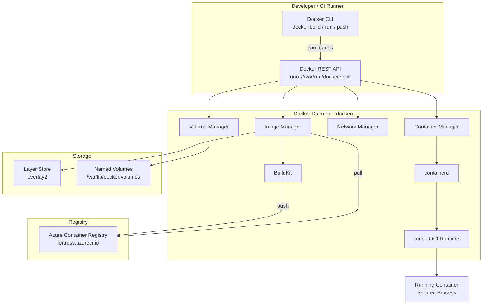
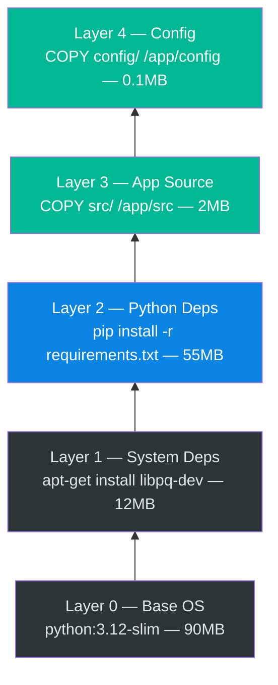
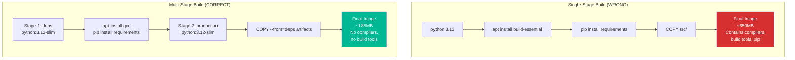
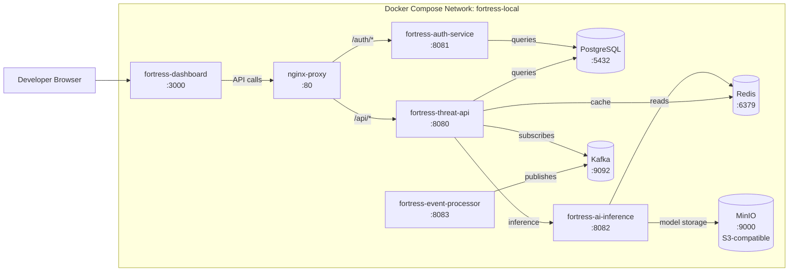
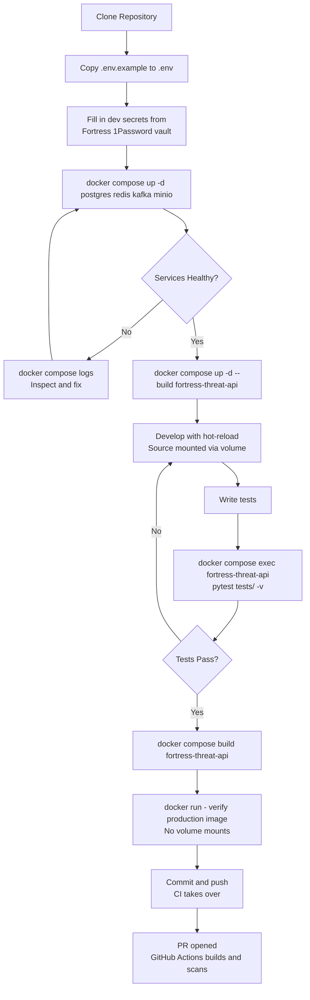

# DOCKER.md — Container Standards & Workflow
**Owner:**Esiana Emmanuel: Cloud Infrastructure & DevOps Team  
**Version:** 1.0.0  
**Last Updated:** 2026-07-01  
**Fortress Engineering Knowledge System (EKS)**
**Audience:** DevOps Engineers, Developers, Platform Engineers  
---

## Table of Contents

1. [Purpose](#purpose)
2. [Scope](#scope)
3. [Overview](#overview)
4. [Architecture](#architecture)
5. [Docker Fundamentals](#docker-fundamentals)
6. [Dockerfile Standards](#dockerfile-standards)
7. [Multi-Stage Builds](#multi-stage-builds)
8. [Docker Compose](#docker-compose)
9. [Fortress Image Standards](#fortress-image-standards)
10. [Local Development Workflow](#local-development-workflow)
11. [Best Practices](#best-practices)
12. [Security Considerations](#security-considerations)
13. [Monitoring](#monitoring)
14. [Troubleshooting](#troubleshooting)
15. [References](#references)
16. [Checklist](#checklist)

---

## Purpose

This document defines the Docker standards, conventions, and operational procedures for the **Fortress AI Cybersecurity Platform**. It serves as the authoritative reference for all engineers building, shipping, and running containerized services within the Fortress ecosystem.

Docker is the foundation of Fortress's deployable unit. Every service — from AI inference engines to event processing pipelines — is packaged as a Docker image and run as a container. This document ensures that all Fortress containers are:

- **Secure by default** — non-root, minimal attack surface, signed, and scanned
- **Reproducible** — identical behavior across dev, QA, staging, and production
- **Optimized** — fast builds, small image sizes, efficient layer caching
- **Observable** — structured logging, health checks, and metrics endpoints

> **Why Docker?**  
> In a cybersecurity platform, predictability is paramount. Docker's content-addressable image model guarantees that what passed security scanning in QA is *exactly* what runs in production — the same binary, the same dependencies, the same filesystem. This determinism is a compliance and security requirement, not just an engineering convenience.

---

## Scope

This document covers:

| In Scope | Out of Scope |
|---|---|
| Dockerfile authoring standards | Kubernetes deployment manifests (see `AKS.md`) |
| Multi-stage build patterns | Azure Container Registry configuration (see `ACR.md`) |
| Docker Compose for local development | CI/CD pipeline configuration (see `CI_CD.md`) |
| Fortress base image catalog | Infrastructure provisioning (see `AZURE.md`) |
| Image naming and tagging conventions | GitHub Actions workflow syntax (see `GITHUB_ACTIONS.md`) |
| Container security hardening | Networking architecture (see `NETWORKING.md`) |
| Local dev environment setup | Secret management in production (see `KEY_VAULT.md`) |

**Audience:** All Fortress engineers, platform engineers, DevOps engineers, and QA engineers.

---

## Overview

The Fortress AI Cybersecurity Platform is composed of several discrete microservices, each independently containerized. Containerization enables the platform to scale specific threat-processing components without scaling the entire system.

### Fortress Service Inventory

| Service | Language/Runtime | Base Image | Approx. Image Size |
|---|---|---|---|
| `fortress-threat-api` | Python 3.12 | `python:3.12-slim` | ~180 MB |
| `fortress-ai-inference` | Python 3.12 + CUDA | `nvidia/cuda:12.3-runtime` | ~3.2 GB |
| `fortress-event-processor` | Go 1.22 | `gcr.io/distroless/static` | ~18 MB |
| `fortress-alert-manager` | Node.js 20 | `node:20-alpine` | ~210 MB |
| `fortress-dashboard` | Node.js 20 (React) | `nginx:1.25-alpine` | ~45 MB |
| `fortress-auth-service` | Go 1.22 | `gcr.io/distroless/static` | ~22 MB |
| `fortress-data-ingestion` | Python 3.12 | `python:3.12-slim` | ~160 MB |
| `fortress-scheduler` | Python 3.12 | `python:3.12-slim` | ~130 MB |

---

## Architecture

### Docker Runtime Architecture

The following diagram shows how Docker components interact on a Fortress host (whether a developer laptop or an AKS node).



### Image Build & Promotion Flow

```mermaid
flowchart LR
    DEV[Developer<br/>Workstation] -->|docker build| LOCAL[Local Image<br/>fortress-threat-api:dev]
    LOCAL -->|docker push| ACR_DEV[ACR Dev Repository<br/>fortress.azurecr.io/dev/...]

    subgraph CI ["CI Pipeline - GitHub Actions"]
        BUILD_JOB[Build Job<br/>Multi-stage build] --> SCAN_JOB[Security Scan<br/>Trivy + Grype]
        SCAN_JOB --> TAG_JOB[Tag & Sign<br/>cosign]
        TAG_JOB --> PUSH_JOB[Push to ACR<br/>SHA + semver tags]
    end

    ACR_DEV --> BUILD_JOB
    PUSH_JOB --> ACR_STAGING[ACR Staging<br/>fortress.azurecr.io/staging/...]
    ACR_STAGING -->|approved| ACR_PROD[ACR Production<br/>fortress.azurecr.io/prod/...]
    ACR_PROD --> AKS[AKS Cluster<br/>Production]

    style CI fill:#1a1a2e,color:#e0e0e0
    style AKS fill:#0078d4,color:#ffffff
```



---

## Docker Fundamentals

Understanding Docker's core internals is necessary to write efficient, secure Dockerfiles for Fortress.

### Docker Engine Components

| Component | Role | Why It Matters for Fortress |
|---|---|---|
| **BuildKit** | Next-gen image builder | Parallel layer building, secret mount support, faster CI builds |
| **containerd** | Container lifecycle manager | AKS uses containerd directly; understanding it aids debugging |
| **runc** | OCI-compliant container runtime | Executes the actual isolated process; the security boundary |
| **overlay2** | Storage driver for layered filesystems | Efficient layer sharing between containers on the same host |

### Images: The Core Concept

A Docker image is an **immutable, ordered stack of filesystem layers**. Each instruction in a Dockerfile (`RUN`, `COPY`, `ADD`) creates a new layer. Layers are content-addressed by SHA-256 hash, making them:

- **Cacheable**: unchanged layers are never re-downloaded or re-built
- **Shareable**: multiple images can reference the same base layers
- **Auditable**: every bit of a Fortress image can be traced to a specific instruction



> **Layer Caching Rule:** Docker caches layers from top to bottom. The moment a layer changes, **all subsequent layers are invalidated**. Always put the most frequently-changing instructions (`COPY src/`) *after* the rarely-changing ones (`pip install`). This is the single biggest factor in build time.

### Containers vs. Images

| Concept | Analogy | In Fortress |
|---|---|---|
| **Image** | Class definition / Blueprint | `fortress-threat-api:1.4.2` stored in ACR |
| **Container** | Instance of that class | A running pod inside AKS |
| **Volume** | Persistent state | PostgreSQL data, model weights |
| **Network** | The wiring between instances | AKS pod networking, Compose networks |

---

## Dockerfile Standards

Every Fortress service MUST have a `Dockerfile` in the root of its repository. The following standards are mandatory.

### Required Dockerfile Structure

```dockerfile
# =============================================================================
# Fortress Dockerfile Template
# Service: <service-name>
# Description: <brief description>
# Maintainer: <team>@fortress.io
# =============================================================================

# ---- Stage 1: Dependencies ----
# Install only production dependencies in a clean layer
FROM <base-image> AS deps
# ... dependency installation

# ---- Stage 2: Builder ----
# Compile, build, or bundle the application
FROM deps AS builder
# ... build steps

# ---- Stage 3: Test (optional, CI only) ----
FROM builder AS test
# ... test execution

# ---- Stage 4: Production ----
# Minimal, hardened final image
FROM <minimal-base-image> AS production
# ... copy artifacts, set entrypoint
```

### Fortress Python Service Dockerfile (Full Example)

This is the canonical Dockerfile for `fortress-threat-api`, the primary REST API for threat detection.

```dockerfile
# =============================================================================
# Fortress Threat Detection API
# Service:     fortress-threat-api
# Runtime:     Python 3.12
# Base:        python:3.12-slim (Debian Bookworm slim)
# Team:        Platform Engineering
# =============================================================================

# ---- Stage 1: Dependency Builder ----
# We install dependencies here separately so this layer is cached
# as long as requirements.txt does not change — even if source code changes.
FROM python:3.12-slim AS deps

# Install system-level build dependencies
# libpq-dev: PostgreSQL client library headers
# build-essential: gcc compiler for packages with C extensions
RUN apt-get update && apt-get install -y --no-install-recommends \
        libpq-dev=15.* \
        build-essential=12.* \
    && rm -rf /var/lib/apt/lists/*

# Set the working directory for dependency installation
WORKDIR /install

# Copy only the dependency manifest — NOT the source code.
# This ensures pip install is only re-run when requirements change.
COPY requirements.txt .

# Install Python dependencies into /install/site-packages
# --prefix: install to a specific directory for easy copying
# --no-cache-dir: do not store pip cache (reduces layer size)
# --no-deps: only install what's in requirements.txt (prevents surprises)
RUN pip install \
        --no-cache-dir \
        --prefix=/install \
        -r requirements.txt


# ---- Stage 2: Production ----
# Start fresh from a clean slim image — no build tools, no compilers.
FROM python:3.12-slim AS production

# LABEL metadata is used by ACR and Fortress tooling for image management
LABEL org.opencontainers.image.title="fortress-threat-api" \
      org.opencontainers.image.description="Fortress AI Threat Detection REST API" \
      org.opencontainers.image.vendor="Fortress Security Inc." \
      org.opencontainers.image.version="${BUILD_VERSION:-dev}" \
      org.opencontainers.image.created="${BUILD_DATE}" \
      org.opencontainers.image.revision="${GIT_COMMIT}" \
      org.opencontainers.image.source="https://github.com/fortress-ai/threat-api" \
      fortress.service="threat-api" \
      fortress.team="platform-engineering"

# Install ONLY runtime system dependencies (not build tools)
RUN apt-get update && apt-get install -y --no-install-recommends \
        libpq5=15.* \
        curl=7.* \
    && rm -rf /var/lib/apt/lists/* \
    && apt-get clean

# Copy the compiled Python packages from the deps stage
COPY --from=deps /install /usr/local

# Create a non-root user and group for running the application.
# SECURITY: Never run Fortress services as root.
# UID/GID 10001 is outside the standard range, reducing collision risk.
RUN groupadd --gid 10001 fortress \
    && useradd \
        --uid 10001 \
        --gid fortress \
        --no-create-home \
        --shell /sbin/nologin \
        fortress

# Set the application working directory
WORKDIR /app

# Copy application source code
# We copy as root, then change ownership in one layer
COPY --chown=fortress:fortress src/ ./src/
COPY --chown=fortress:fortress config/ ./config/

# Environment defaults
# These are safe, non-sensitive defaults. Secrets come from Key Vault at runtime.
ENV PYTHONUNBUFFERED=1 \
    PYTHONDONTWRITEBYTECODE=1 \
    PYTHONPATH=/app \
    PORT=8080 \
    LOG_LEVEL=INFO \
    ENVIRONMENT=production

# Switch to the non-root user
USER fortress

# Expose the application port
# This is documentation only — actual port binding happens in AKS/Compose
EXPOSE 8080

# Health check: verifies the service responds on /health
# --interval: check every 30 seconds
# --timeout: fail if no response within 10 seconds
# --start-period: give the app 15 seconds to start before counting failures
# --retries: mark unhealthy after 3 consecutive failures
HEALTHCHECK --interval=30s --timeout=10s --start-period=15s --retries=3 \
    CMD curl -f http://localhost:8080/health || exit 1

# Use exec form (JSON array) — NOT shell form.
# Exec form: PID 1 is the app, signals reach it directly (proper shutdown)
# Shell form: PID 1 is /bin/sh, signals may not reach the app (zombie processes)
ENTRYPOINT ["python", "-m", "uvicorn"]
CMD ["src.main:app", "--host", "0.0.0.0", "--port", "8080", "--workers", "4"]
```

### Fortress Go Service Dockerfile (Distroless)

For the highest-security services (`fortress-event-processor`, `fortress-auth-service`), we use Google's distroless images — no shell, no package manager, minimal attack surface.

```dockerfile
# =============================================================================
# Fortress Event Processor
# Service:     fortress-event-processor
# Runtime:     Go 1.22
# Base:        gcr.io/distroless/static (no shell, no libc)
# Team:        Platform Engineering
# =============================================================================

# ---- Stage 1: Build ----
FROM golang:1.22-alpine AS builder

# Install security certificates (needed for HTTPS in distroless)
RUN apk add --no-cache ca-certificates=20240226-r0 tzdata

WORKDIR /build

# Download dependencies first (cached separately from source)
COPY go.mod go.sum ./
RUN go mod download && go mod verify

# Copy source and build
# CGO_ENABLED=0: Static binary (no cgo dependencies — required for distroless/static)
# GOOS=linux: Compile for Linux target
# -ldflags: Embed build metadata, strip debug info for smaller binary
COPY . .
RUN CGO_ENABLED=0 GOOS=linux GOARCH=amd64 go build \
    -ldflags="-w -s \
        -X 'main.version=${BUILD_VERSION}' \
        -X 'main.buildDate=${BUILD_DATE}' \
        -X 'main.gitCommit=${GIT_COMMIT}'" \
    -o /build/event-processor \
    ./cmd/event-processor/

# ---- Stage 2: Production (Distroless) ----
# gcr.io/distroless/static contains:
#   - ca-certificates (for HTTPS)
#   - tzdata (for time zone handling)
#   - /etc/passwd (for non-root user)
# It does NOT contain: shell, curl, apt, ls, cat — nothing.
FROM gcr.io/distroless/static:nonroot AS production

LABEL org.opencontainers.image.title="fortress-event-processor" \
      fortress.service="event-processor" \
      fortress.security-level="high"

# Copy timezone data and certificates from builder
COPY --from=builder /usr/share/zoneinfo /usr/share/zoneinfo
COPY --from=builder /etc/ssl/certs/ca-certificates.crt /etc/ssl/certs/

# Copy the compiled binary
COPY --from=builder /build/event-processor /usr/local/bin/event-processor

# distroless:nonroot runs as UID 65532 by default
USER nonroot:nonroot

EXPOSE 8080

ENTRYPOINT ["/usr/local/bin/event-processor"]
```

### Fortress Node.js Frontend Dockerfile

```dockerfile
# =============================================================================
# Fortress Security Dashboard (React SPA)
# Service:     fortress-dashboard
# Runtime:     Node.js 20 (build) → nginx 1.25 (serve)
# =============================================================================

# ---- Stage 1: Dependency Install ----
FROM node:20-alpine AS deps

WORKDIR /app
COPY package.json package-lock.json ./

# npm ci: clean install — uses lockfile exactly, faster and safer than npm install
RUN npm ci --include=dev

# ---- Stage 2: Build ----
FROM node:20-alpine AS builder

WORKDIR /app
COPY --from=deps /app/node_modules ./node_modules
COPY . .

# Build arguments injected at CI build time
ARG VITE_API_URL
ARG VITE_AUTH_CLIENT_ID
ARG VITE_ENVIRONMENT

# Build the React SPA for production
RUN npm run build

# ---- Stage 3: Production (nginx) ----
FROM nginx:1.25-alpine AS production

LABEL org.opencontainers.image.title="fortress-dashboard" \
      fortress.service="dashboard"

# Replace default nginx config with Fortress-specific config
# Fortress nginx config includes:
#   - Security headers (CSP, HSTS, X-Frame-Options)
#   - SPA routing (try_files for React Router)
#   - Gzip compression
#   - Static asset caching
COPY nginx/nginx.conf /etc/nginx/nginx.conf
COPY nginx/default.conf /etc/nginx/conf.d/default.conf

# Copy built React app from builder stage
COPY --from=builder /app/dist /usr/share/nginx/html

# Run nginx as non-root
# Note: nginx worker processes bind to port 8080 (non-privileged) instead of 80
RUN chown -R nginx:nginx /usr/share/nginx/html \
    && chown -R nginx:nginx /var/cache/nginx \
    && chown -R nginx:nginx /var/log/nginx \
    && touch /var/run/nginx.pid \
    && chown -R nginx:nginx /var/run/nginx.pid

USER nginx

EXPOSE 8080

CMD ["nginx", "-g", "daemon off;"]
```

---

## Multi-Stage Builds

Multi-stage builds are **mandatory** for all Fortress production images. They are the most impactful technique for creating secure, small production images.

### Why Multi-Stage Builds?

Without multi-stage builds, a Python image would include pip, setuptools, gcc, header files, and all build tooling in the final image — tools an attacker could exploit if the container is compromised. Multi-stage builds ensure the production image contains only what is needed to run the application.



### Build Stage Taxonomy

| Stage Name | Purpose | Included in Final Image? |
|---|---|---|
| `deps` | Install all dependencies (including dev) | No |
| `builder` | Compile, transpile, bundle | No |
| `test` | Run unit/integration tests | No (CI only) |
| `production` | Minimal runtime image | ✅ YES |

### CI Test Integration in Multi-Stage Build

The test stage allows CI to run tests **inside the Docker build** — no separate test environment needed, and tests run against the exact same environment as production.

```dockerfile
# ---- Stage: Test ----
# Only built when --target test is passed (in CI)
FROM builder AS test

# Install test dependencies
RUN pip install --no-cache-dir pytest pytest-cov pytest-asyncio httpx

# Run tests as part of the build
# If tests fail, the docker build fails — tests are a build gate
RUN pytest tests/ \
    --cov=src \
    --cov-report=xml:/coverage/coverage.xml \
    --cov-fail-under=80 \
    -v

# ---- Stage: Production ----
FROM python:3.12-slim AS production
# ... (does NOT inherit from test — clean start)
```

```bash
# CI: build and run tests
docker build --target test -t fortress-threat-api:test .

# CI: build production image (skips test stage entirely)
docker build --target production -t fortress-threat-api:prod .
```

---

## Docker Compose

Docker Compose is the standard tool for **local development** at Fortress. It runs the full platform stack on a developer's laptop, replicating the production topology.

> **Important:** Docker Compose is for **local development and integration testing only**. Production deployments use Kubernetes (AKS). Never use Docker Compose in production.

### Local Stack Architecture



### `docker-compose.yml` — Full Fortress Local Stack

```yaml
# docker-compose.yml
# Fortress AI Platform — Local Development Stack
# Usage: docker compose up -d
# Docs: https://docs.fortress.io/local-dev

version: "3.9"

# ============================================================
# Networks
# Fortress services communicate on the 'fortress-local' network
# ============================================================
networks:
  fortress-local:
    driver: bridge
    ipam:
      config:
        - subnet: 172.20.0.0/16

# ============================================================
# Volumes
# Named volumes persist data between docker compose restarts
# ============================================================
volumes:
  postgres-data:
    name: fortress_postgres_data
  redis-data:
    name: fortress_redis_data
  minio-data:
    name: fortress_minio_data
  kafka-data:
    name: fortress_kafka_data

# ============================================================
# Services
# ============================================================
services:

  # --- Infrastructure: PostgreSQL ---
  postgres:
    image: postgres:16-alpine
    container_name: fortress-postgres
    restart: unless-stopped
    environment:
      POSTGRES_DB: fortress_dev
      POSTGRES_USER: fortress
      POSTGRES_PASSWORD: ${POSTGRES_PASSWORD:-fortress_dev_local}  # Override in .env
      PGDATA: /var/lib/postgresql/data/pgdata
    volumes:
      - postgres-data:/var/lib/postgresql/data
      - ./scripts/db/init:/docker-entrypoint-initdb.d:ro  # Init scripts
    ports:
      - "5432:5432"
    networks:
      - fortress-local
    healthcheck:
      test: ["CMD-SHELL", "pg_isready -U fortress -d fortress_dev"]
      interval: 10s
      timeout: 5s
      retries: 5
      start_period: 10s

  # --- Infrastructure: Redis ---
  redis:
    image: redis:7.2-alpine
    container_name: fortress-redis
    restart: unless-stopped
    command: redis-server --requirepass ${REDIS_PASSWORD:-fortress_dev_local} --maxmemory 512mb --maxmemory-policy allkeys-lru
    volumes:
      - redis-data:/data
    ports:
      - "6379:6379"
    networks:
      - fortress-local
    healthcheck:
      test: ["CMD", "redis-cli", "--no-auth-warning", "-a", "${REDIS_PASSWORD:-fortress_dev_local}", "ping"]
      interval: 10s
      timeout: 5s
      retries: 5

  # --- Infrastructure: Kafka ---
  kafka:
    image: confluentinc/cp-kafka:7.6.0
    container_name: fortress-kafka
    restart: unless-stopped
    environment:
      KAFKA_NODE_ID: 1
      KAFKA_PROCESS_ROLES: broker,controller
      KAFKA_CONTROLLER_QUORUM_VOTERS: 1@kafka:9093
      KAFKA_LISTENERS: PLAINTEXT://0.0.0.0:9092,CONTROLLER://0.0.0.0:9093
      KAFKA_ADVERTISED_LISTENERS: PLAINTEXT://kafka:9092
      KAFKA_CONTROLLER_LISTENER_NAMES: CONTROLLER
      KAFKA_OFFSETS_TOPIC_REPLICATION_FACTOR: 1
      CLUSTER_ID: "MkU3OEVBNTcwNTJENDM2Qk"
    volumes:
      - kafka-data:/var/lib/kafka/data
    ports:
      - "9092:9092"
    networks:
      - fortress-local
    healthcheck:
      test: ["CMD", "kafka-topics", "--bootstrap-server", "localhost:9092", "--list"]
      interval: 30s
      timeout: 10s
      retries: 5
      start_period: 30s

  # --- Infrastructure: MinIO (local S3 replacement) ---
  minio:
    image: minio/minio:RELEASE.2024-05-01T01-11-10Z
    container_name: fortress-minio
    restart: unless-stopped
    command: server /data --console-address ":9001"
    environment:
      MINIO_ROOT_USER: ${MINIO_ACCESS_KEY:-fortress}
      MINIO_ROOT_PASSWORD: ${MINIO_SECRET_KEY:-fortress_dev_local}
    volumes:
      - minio-data:/data
    ports:
      - "9000:9000"   # S3 API
      - "9001:9001"   # MinIO Console
    networks:
      - fortress-local
    healthcheck:
      test: ["CMD", "mc", "ready", "local"]
      interval: 30s
      timeout: 20s
      retries: 3

  # ============================================================
  # Fortress Application Services
  # ============================================================

  # --- Fortress: Threat Detection API ---
  fortress-threat-api:
    build:
      context: ../services/threat-api
      dockerfile: Dockerfile
      target: production  # Use the production stage, not test
      args:
        BUILD_VERSION: dev
        BUILD_DATE: "${BUILD_DATE:-}"
        GIT_COMMIT: "${GIT_COMMIT:-local}"
    image: fortress-threat-api:dev
    container_name: fortress-threat-api
    restart: unless-stopped
    depends_on:
      postgres:
        condition: service_healthy
      redis:
        condition: service_healthy
      kafka:
        condition: service_healthy
    environment:
      # Non-sensitive configuration
      ENVIRONMENT: development
      LOG_LEVEL: DEBUG
      PORT: 8080
      POSTGRES_HOST: postgres
      POSTGRES_PORT: 5432
      POSTGRES_DB: fortress_dev
      POSTGRES_USER: fortress
      REDIS_HOST: redis
      REDIS_PORT: 6379
      KAFKA_BOOTSTRAP_SERVERS: kafka:9092
      AI_INFERENCE_URL: http://fortress-ai-inference:8082
      # Sensitive config — loaded from .env file (never commit .env!)
      POSTGRES_PASSWORD: ${POSTGRES_PASSWORD:-fortress_dev_local}
      REDIS_PASSWORD: ${REDIS_PASSWORD:-fortress_dev_local}
      JWT_SECRET: ${JWT_SECRET:-dev_only_insecure_secret_do_not_use_in_prod}
      ENCRYPTION_KEY: ${ENCRYPTION_KEY:-dev_only_key_32_chars_minimum__}
    ports:
      - "8080:8080"
    volumes:
      # Hot-reload: mount source for development (not in production!)
      - ../services/threat-api/src:/app/src:ro
    networks:
      - fortress-local
    healthcheck:
      test: ["CMD", "curl", "-f", "http://localhost:8080/health"]
      interval: 30s
      timeout: 10s
      retries: 3
      start_period: 20s

  # --- Fortress: Auth Service ---
  fortress-auth-service:
    build:
      context: ../services/auth-service
      dockerfile: Dockerfile
      target: production
    image: fortress-auth-service:dev
    container_name: fortress-auth-service
    restart: unless-stopped
    depends_on:
      postgres:
        condition: service_healthy
      redis:
        condition: service_healthy
    environment:
      ENVIRONMENT: development
      LOG_LEVEL: DEBUG
      PORT: 8081
      POSTGRES_HOST: postgres
      POSTGRES_PORT: 5432
      POSTGRES_DB: fortress_dev
      POSTGRES_USER: fortress
      POSTGRES_PASSWORD: ${POSTGRES_PASSWORD:-fortress_dev_local}
      REDIS_HOST: redis
      JWT_SECRET: ${JWT_SECRET:-dev_only_insecure_secret_do_not_use_in_prod}
      OAUTH_CLIENT_ID: ${OAUTH_CLIENT_ID:-}
      OAUTH_CLIENT_SECRET: ${OAUTH_CLIENT_SECRET:-}
    ports:
      - "8081:8081"
    networks:
      - fortress-local
    healthcheck:
      test: ["CMD", "curl", "-f", "http://localhost:8081/health"]
      interval: 30s
      timeout: 10s
      retries: 3
      start_period: 15s

  # --- Fortress: AI Inference Engine ---
  fortress-ai-inference:
    build:
      context: ../services/ai-inference
      dockerfile: Dockerfile
      target: production
    image: fortress-ai-inference:dev
    container_name: fortress-ai-inference
    restart: unless-stopped
    depends_on:
      redis:
        condition: service_healthy
      minio:
        condition: service_healthy
    environment:
      ENVIRONMENT: development
      LOG_LEVEL: DEBUG
      PORT: 8082
      REDIS_HOST: redis
      REDIS_PORT: 6379
      REDIS_PASSWORD: ${REDIS_PASSWORD:-fortress_dev_local}
      MINIO_ENDPOINT: http://minio:9000
      MINIO_ACCESS_KEY: ${MINIO_ACCESS_KEY:-fortress}
      MINIO_SECRET_KEY: ${MINIO_SECRET_KEY:-fortress_dev_local}
      MODEL_BUCKET: fortress-models
      # CPU-only mode for local development (no GPU required)
      DEVICE: cpu
      MODEL_CACHE_DIR: /tmp/model-cache
    ports:
      - "8082:8082"
    volumes:
      - /tmp/fortress-model-cache:/tmp/model-cache  # Persist model downloads locally
    networks:
      - fortress-local
    healthcheck:
      test: ["CMD", "curl", "-f", "http://localhost:8082/health"]
      interval: 30s
      timeout: 30s  # AI service takes longer to respond (model loading)
      retries: 3
      start_period: 60s  # Give AI service time to load models

  # --- Fortress: Dashboard (React SPA) ---
  fortress-dashboard:
    build:
      context: ../services/dashboard
      dockerfile: Dockerfile
      target: production
      args:
        VITE_API_URL: http://localhost/api
        VITE_AUTH_CLIENT_ID: fortress-dev-client
        VITE_ENVIRONMENT: development
    image: fortress-dashboard:dev
    container_name: fortress-dashboard
    restart: unless-stopped
    ports:
      - "3000:8080"
    networks:
      - fortress-local
    healthcheck:
      test: ["CMD", "curl", "-f", "http://localhost:8080/"]
      interval: 30s
      timeout: 5s
      retries: 3
```

### Docker Compose Override Files

Use override files for environment-specific configurations:

```yaml
# docker-compose.override.yml
# Automatically merged with docker-compose.yml when running `docker compose up`
# This file is gitignored — each developer maintains their own

version: "3.9"
services:
  fortress-threat-api:
    environment:
      LOG_LEVEL: DEBUG
      # Enable hot-reload for local development
      RELOAD: "true"
    volumes:
      - ../services/threat-api/src:/app/src  # Mount for live code changes
```

### Useful Compose Commands

```bash
# Start the full stack (detached)
docker compose up -d

# Start only infrastructure dependencies
docker compose up -d postgres redis kafka minio

# Start specific services
docker compose up -d fortress-threat-api fortress-auth-service

# View logs (follow)
docker compose logs -f fortress-threat-api

# View logs from all services
docker compose logs -f

# Rebuild a specific service image
docker compose build fortress-threat-api

# Rebuild and restart a service
docker compose up -d --build fortress-threat-api

# Execute a command inside a running container
docker compose exec fortress-threat-api bash

# Run database migrations
docker compose exec fortress-threat-api python -m alembic upgrade head

# Stop and remove all containers (preserves volumes)
docker compose down

# Stop, remove containers AND volumes (clean slate)
docker compose down -v

# Check service health status
docker compose ps
```

---

## Fortress Image Standards

### Naming Convention

All Fortress images follow this naming convention in Azure Container Registry:

```
fortress.azurecr.io/{environment}/{service-name}:{version-tag}
```

| Part | Values | Example |
|---|---|---|
| Registry | `fortress.azurecr.io` | `fortress.azurecr.io` |
| Environment | `dev`, `staging`, `prod` | `prod` |
| Service name | Lowercase, hyphenated | `threat-api` |
| Version tag | SemVer or SHA | `1.4.2` or `sha-a3f9b2c` |

**Examples:**

```
fortress.azurecr.io/prod/threat-api:1.4.2
fortress.azurecr.io/prod/threat-api:sha-a3f9b2c1d4e5f678
fortress.azurecr.io/staging/ai-inference:1.5.0-rc.1
fortress.azurecr.io/dev/dashboard:feature-new-alerts-sha-1234567
```

### Tagging Strategy

Every image receives multiple tags simultaneously:

```bash
# In CI, all three tags point to the same image digest

docker tag fortress-threat-api:build \
  fortress.azurecr.io/prod/threat-api:1.4.2          # Semantic version (immutable release)

docker tag fortress-threat-api:build \
  fortress.azurecr.io/prod/threat-api:sha-a3f9b2c    # Git SHA (traceable to commit)

docker tag fortress-threat-api:build \
  fortress.azurecr.io/prod/threat-api:latest          # Latest (used by staging only)
```

> ⚠️ **Production Warning:** The `latest` tag is **never** used in production Kubernetes manifests. Always pin to a specific semantic version or SHA tag. `latest` is a floating tag and destroys reproducibility.

### Approved Base Image Catalog

Only the following base images are approved for use in Fortress production services. Using unapproved base images requires a security review.

| Base Image | Use Case | Security Posture | Notes |
|---|---|---|---|
| `python:3.12-slim` | Python APIs, ML preprocessing | Medium | Debian-based, small but has shell |
| `node:20-alpine` | Node.js services | Medium | Alpine-based, musl libc |
| `golang:1.22-alpine` | Go builder stage only | N/A (build only) | Never used as final image |
| `gcr.io/distroless/static:nonroot` | Go final image | Very High | No shell, no package manager |
| `gcr.io/distroless/python3:nonroot` | Python final (advanced) | Very High | Requires manual dependency copy |
| `nginx:1.25-alpine` | Static file serving | Medium | Frontend SPAs only |
| `nvidia/cuda:12.3-runtime-ubuntu22.04` | GPU inference | Medium | AI inference only, large image |
| `postgres:16-alpine` | Local dev DB only | N/A | Never in production (use Azure PaaS) |

### `.dockerignore` — Required for Every Service

```dockerignore
# .dockerignore
# Prevents unnecessary files from being sent to the Docker build context
# Every Fortress service repository MUST include this file

# Version control
.git
.gitignore
.gitattributes

# Documentation
docs/
*.md
README*
LICENSE*
CHANGELOG*

# Development config
.env
.env.*
.env.local
.env.development
*.local

# Test files
tests/
test/
__tests__/
*.test.py
*.spec.ts
coverage/
.coverage
htmlcov/

# CI/CD
.github/
.gitlab-ci.yml
Jenkinsfile

# Docker files (not needed inside the image)
Dockerfile*
docker-compose*.yml
.dockerignore

# IDE files
.vscode/
.idea/
*.swp
*.swo
.DS_Store
Thumbs.db

# Python
__pycache__/
*.pyc
*.pyo
*.pyd
.Python
.venv/
venv/
env/
*.egg-info/
dist/
build/
.pytest_cache/
.mypy_cache/
.ruff_cache/

# Node.js
node_modules/
npm-debug.log*
yarn-error.log*
.npm/
.yarn/

# Go
vendor/
*.test

# Secrets (should never be here, but belt-and-suspenders)
*.pem
*.key
*.crt
*.p12
secrets/
```

---

## Local Development Workflow

The following workflow is the standard process for Fortress engineers developing new features.



### Step-by-Step: First-Time Setup

```bash
# 1. Clone the repository
git clone https://github.com/fortress-ai/threat-api.git
cd threat-api

# 2. Create your local environment file
cp .env.example .env
# Edit .env with values from the Fortress 1Password 'Local Dev' vault

# 3. Start infrastructure dependencies
docker compose up -d postgres redis kafka minio

# 4. Wait for dependencies to be healthy
docker compose ps
# All should show "healthy" status

# 5. Run database migrations
docker compose run --rm fortress-threat-api python -m alembic upgrade head

# 6. Start all services
docker compose up -d

# 7. Verify everything is running
docker compose ps
curl http://localhost:8080/health

# 8. View logs
docker compose logs -f fortress-threat-api
```

### Development Iteration Cycle

```bash
# Make code changes (if source is mounted, hot-reload is automatic)
# Otherwise, rebuild:
docker compose up -d --build fortress-threat-api

# Run tests inside the container (matches CI environment exactly)
docker compose exec fortress-threat-api pytest tests/ -v --cov=src

# Check application logs
docker compose logs -f fortress-threat-api

# Inspect the container filesystem (debugging)
docker compose exec fortress-threat-api bash

# Check environment variables inside the container
docker compose exec fortress-threat-api env | sort

# Test the production image (no mounts, no dev tools)
docker build --target production -t fortress-threat-api:local-prod .
docker run --rm -p 8080:8080 \
  --env-file .env \
  fortress-threat-api:local-prod
```

---

## Best Practices

> ### 🏰 Fortress Best Practices — Docker

**Build Efficiency**

- ✅ **Order Dockerfile instructions** from least-to-most-frequently-changing
- ✅ **Always use `.dockerignore`** — never send `node_modules` or `.git` to build context
- ✅ **Use BuildKit** (`DOCKER_BUILDKIT=1`) for parallel builds and better caching
- ✅ **Pin base image tags** — use `python:3.12.4-slim` not `python:latest`
- ✅ **Combine RUN commands** for system packages to reduce layer count
- ✅ **Delete package caches** in the same `RUN` layer they were created

**Security**

- ✅ **Never run as root** — create a dedicated non-root user (UID > 10000)
- ✅ **Use read-only filesystems** where possible (`--read-only` flag)
- ✅ **Never embed secrets** in Dockerfiles, images, or build args
- ✅ **Scan every image** with Trivy before pushing to ACR
- ✅ **Use distroless images** for Go services
- ✅ **Sign images** with cosign in CI

**Operational**

- ✅ **Always include HEALTHCHECK** — enables AKS liveness/readiness probes
- ✅ **Use exec form ENTRYPOINT** — ensures proper signal handling (graceful shutdown)
- ✅ **Set PYTHONUNBUFFERED=1** for Python — ensures logs appear in real time
- ✅ **Include OCI labels** — enables image traceability in ACR

### Common Mistakes

> ### ⚠️ Common Mistakes — Avoid These

| Mistake | Why It's Wrong | Correct Approach |
|---|---|---|
| `FROM python:latest` | Unpredictable — breaks builds silently | `FROM python:3.12.4-slim` |
| `COPY . .` before `pip install` | Invalidates pip cache on every source change | Copy requirements first, then source |
| `RUN pip install` without `--no-cache-dir` | Stores pip cache in the layer, wastes ~50MB | Always use `--no-cache-dir` |
| Running as root (`USER` not set) | Security violation — attackers get root | Always create and use a non-root user |
| Storing secrets in environment variables in Dockerfile | Secrets visible in `docker history` and image layers | Use Key Vault / runtime injection only |
| `ENTRYPOINT python app.py` (shell form) | Shell becomes PID 1, signals not forwarded | `ENTRYPOINT ["python", "app.py"]` |
| Using `docker-compose up` in production | No health management, no self-healing | Use AKS / Kubernetes |
| `COPY . /app` in final stage | Copies test files, `.env`, `.git` into image | Be explicit: `COPY src/ /app/src/` |
| `:latest` tag in production manifests | Not reproducible — can change without notice | Pin to `sha-abc123` or `1.2.3` |
| No `.dockerignore` | Sends entire repo to build daemon — slow and risky | Always include `.dockerignore` |

---

## Security Considerations

Security is a first-class concern for all Fortress container images. The following controls are mandatory.

### Container Security Checklist

#### Image Hardening

```bash
# Check who the container runs as
docker inspect fortress-threat-api:prod | jq '.[].Config.User'
# Expected output: "10001:10001"   (not "root" or "0")

# Check for HEALTHCHECK definition
docker inspect fortress-threat-api:prod | jq '.[].Config.Healthcheck'

# Scan image for vulnerabilities with Trivy (required in CI)
trivy image \
  --severity HIGH,CRITICAL \
  --exit-code 1 \
  --format sarif \
  --output trivy-results.sarif \
  fortress.azurecr.io/prod/threat-api:1.4.2

# Check image layers for exposed secrets
docker history --no-trunc fortress-threat-api:prod
```

#### Runtime Security

```yaml
# Kubernetes SecurityContext (required for all Fortress pods)
# See AKS.md for full pod spec
securityContext:
  runAsNonRoot: true
  runAsUser: 10001
  runAsGroup: 10001
  allowPrivilegeEscalation: false
  readOnlyRootFilesystem: true
  seccompProfile:
    type: RuntimeDefault
  capabilities:
    drop:
      - ALL
```

#### Secret Injection — Never In Images

```bash
# ❌ WRONG: Secret in Dockerfile ENV
ENV DATABASE_PASSWORD=my_secret_password

# ❌ WRONG: Secret in build arg (visible in docker history)
ARG DATABASE_PASSWORD
ENV DATABASE_PASSWORD=${DATABASE_PASSWORD}

# ✅ CORRECT: Secret injected at runtime via AKS + Key Vault
# The container reads from environment variables populated by Azure CSI driver
# See KEY_VAULT.md for the Key Vault setup

# ✅ CORRECT: For local dev, use .env file (gitignored)
docker run --env-file .env fortress-threat-api:prod
```

#### Image Signing

All production images MUST be signed with cosign:

```bash
# In CI, after pushing to ACR:
cosign sign \
  --key azurekv://fortress-keyvault.vault.azure.net/keys/cosign-key \
  fortress.azurecr.io/prod/threat-api:1.4.2

# Verify signature before deploying
cosign verify \
  --key azurekv://fortress-keyvault.vault.azure.net/keys/cosign-key \
  fortress.azurecr.io/prod/threat-api:1.4.2
```

---

## Monitoring

### Container Metrics

Fortress containers expose metrics in Prometheus format at `/metrics`. Azure Monitor and AKS scrape these automatically.

| Metric | Description | Alert Threshold |
|---|---|---|
| `container_cpu_usage_seconds_total` | CPU time consumed | > 80% of limit for 5m |
| `container_memory_working_set_bytes` | Memory in use | > 90% of limit |
| `container_restart_count` | Number of container restarts | > 3 in 1 hour |
| `http_requests_total` | Total HTTP requests | N/A (informational) |
| `http_request_duration_seconds` | Request latency | p99 > 2s |

### Log Standards

All Fortress containers write structured JSON logs to stdout. The log format is:

```json
{
  "timestamp": "2025-07-01T10:23:45.123Z",
  "level": "INFO",
  "service": "fortress-threat-api",
  "version": "1.4.2",
  "trace_id": "abc123def456",
  "span_id": "7890ghij",
  "message": "Threat event processed successfully",
  "threat_id": "evt-9876",
  "processing_time_ms": 145,
  "threat_score": 0.94
}
```

```bash
# View real-time structured logs
docker compose logs -f fortress-threat-api | jq '.'

# Filter for errors only
docker compose logs fortress-threat-api | jq 'select(.level == "ERROR")'

# Get stats on a running container
docker stats fortress-threat-api --no-stream
```

---

## Troubleshooting

### Common Issues and Solutions

#### Container Won't Start

```bash
# Check exit code and last logs
docker compose ps
docker compose logs --tail 50 fortress-threat-api

# Common causes:
# Exit code 1: Application error (missing env var, can't connect to DB)
# Exit code 137: OOM killed (increase memory limit)
# Exit code 143: SIGTERM (graceful shutdown — check logs before it stopped)

# Check if the image even exists
docker images | grep fortress-threat-api

# Try running with a shell to debug (only works for non-distroless images)
docker run --rm -it --entrypoint bash fortress-threat-api:dev
```

#### Health Check Failing

```bash
# Test the health check endpoint manually
docker compose exec fortress-threat-api curl -v http://localhost:8080/health

# View health check logs
docker inspect --format='{{json .State.Health}}' fortress-threat-api | jq '.'

# Common health check failure causes:
# 1. App not listening on expected port → check PORT env var
# 2. App started but DB migration not complete → check startup ordering
# 3. Health check timeout too short → increase --timeout value
```

#### Build Cache Issues

```bash
# Force a clean build (no cache)
docker compose build --no-cache fortress-threat-api

# Or for a specific stage
DOCKER_BUILDKIT=1 docker build \
  --no-cache \
  --target production \
  -t fortress-threat-api:clean .

# Prune build cache
docker builder prune

# Check current cache usage
docker system df
```

#### Container Can't Connect to Another Service

```bash
# Verify both containers are on the same network
docker network inspect fortress-docs_fortress-local | jq '.[].Containers'

# Test connectivity from inside a container
docker compose exec fortress-threat-api curl http://postgres:5432

# Check service DNS resolution
docker compose exec fortress-threat-api nslookup postgres

# View network configuration
docker compose exec fortress-threat-api cat /etc/hosts
docker compose exec fortress-threat-api cat /etc/resolv.conf
```

#### High Memory Usage / OOM

```bash
# Check memory usage
docker stats --no-stream

# Check if container was OOM killed
docker inspect fortress-ai-inference | jq '.[].State.OOMKilled'

# Check system memory
docker system info | grep -i memory

# View container resource limits
docker inspect fortress-threat-api | jq '.[].HostConfig.Memory'
```

#### Disk Space Issues

```bash
# Check Docker disk usage
docker system df -v

# Clean up stopped containers
docker container prune

# Clean up unused images
docker image prune -a

# Clean up unused volumes (WARNING: data loss)
docker volume prune

# Nuclear option — clean everything unused
docker system prune -a --volumes
# ⚠️  Only run this on developer workstations, never on servers
```

### Useful Docker Reference Commands

```bash
# --- Image Commands ---
docker images                                    # List all local images
docker pull fortress.azurecr.io/prod/threat-api:1.4.2   # Pull specific image
docker rmi fortress-threat-api:old              # Remove image
docker history fortress-threat-api:prod         # View image layers
docker inspect fortress-threat-api:prod         # Full image metadata

# --- Build Commands ---
docker build -t fortress-threat-api:dev .       # Basic build
docker build --target production -t myimg .     # Build specific stage
docker build --no-cache -t myimg .              # Build without cache
DOCKER_BUILDKIT=1 docker build -t myimg .       # Enable BuildKit

# --- Container Commands ---
docker ps                                        # Running containers
docker ps -a                                     # All containers (including stopped)
docker logs -f <container>                      # Follow logs
docker exec -it <container> bash                # Shell into container
docker inspect <container>                       # Container metadata
docker stats                                     # Live resource usage
docker stop <container>                          # Graceful stop (SIGTERM)
docker kill <container>                          # Force stop (SIGKILL)
docker rm <container>                            # Remove stopped container

# --- Docker Compose Commands ---
docker compose up -d                            # Start all services detached
docker compose down                             # Stop and remove containers
docker compose down -v                          # Stop, remove containers and volumes
docker compose ps                               # Service status
docker compose logs -f <service>                # Follow service logs
docker compose exec <service> <cmd>             # Run command in service
docker compose run --rm <service> <cmd>         # Run one-off command
docker compose build <service>                  # Rebuild service image
docker compose pull                             # Pull updated images

# --- Registry Commands ---
az acr login --name fortress                    # Login to ACR
docker push fortress.azurecr.io/prod/threat-api:1.4.2  # Push image
az acr repository list --name fortress         # List ACR repos
az acr repository show-tags --name fortress --repository prod/threat-api  # List tags
```

---

## References

| Resource | Link | Notes |
|---|---|---|
| Docker Official Documentation | https://docs.docker.com | Core reference |
| BuildKit Documentation | https://github.com/moby/buildkit | Advanced build features |
| Dockerfile Best Practices | https://docs.docker.com/develop/develop-images/dockerfile_best-practices/ | Official guide |
| Docker Compose Reference | https://docs.docker.com/compose/compose-file/ | Full compose file spec |
| Google Distroless Images | https://github.com/GoogleContainerTools/distroless | Minimal base images |
| Trivy Security Scanner | https://trivy.dev | Container vulnerability scanner |
| cosign Image Signing | https://docs.sigstore.dev/cosign/overview/ | Supply chain security |
| OCI Image Spec | https://github.com/opencontainers/image-spec | Image format standard |
| Fortress ACR Guide | `docs/cloud/ACR.md` | Fortress-specific registry guide |
| Fortress AKS Guide | `docs/cloud/AKS.md` | Kubernetes deployment |
| Fortress CI/CD Guide | `docs/deployment/CI_CD.md` | Pipeline configuration |
| Fortress Key Vault Guide | `docs/security/KEY_VAULT.md` | Secret management |

---

## Checklist

Use this checklist when creating or reviewing a Dockerfile for a Fortress service.

### Dockerfile Review Checklist

#### Structure

- [ ] Service name and description in header comment
- [ ] Multi-stage build implemented (`deps`, `builder`, `production` stages)
- [ ] `.dockerignore` file present and comprehensive
- [ ] Dockerfile is in the repository root

#### Base Image

- [ ] Base image uses an approved image from the Fortress catalog
- [ ] Base image version is pinned (not `:latest`)
- [ ] Final production stage uses the minimal appropriate base image

#### Layer Optimization

- [ ] Dependency files (`requirements.txt`, `package.json`) are copied before source code
- [ ] System packages installed with `--no-install-recommends`
- [ ] Package caches cleaned in the same `RUN` layer (e.g., `rm -rf /var/lib/apt/lists/*`)
- [ ] `pip install` uses `--no-cache-dir`
- [ ] `npm ci` used instead of `npm install`

#### Security

- [ ] Application runs as a non-root user
- [ ] Non-root user UID is > 10000
- [ ] No secrets, passwords, or API keys in the Dockerfile
- [ ] No secrets in `ENV` instructions
- [ ] Build args (`ARG`) not used for secrets
- [ ] `HEALTHCHECK` instruction defined

#### Labels & Metadata

- [ ] OCI-standard labels present (`org.opencontainers.image.*`)
- [ ] Fortress-specific labels present (`fortress.service`, `fortress.team`)
- [ ] `BUILD_VERSION`, `GIT_COMMIT`, `BUILD_DATE` build args defined

#### Signal Handling

- [ ] `ENTRYPOINT` uses exec form (`["command", "arg"]`), not shell form
- [ ] Application handles SIGTERM for graceful shutdown

#### Python-Specific

- [ ] `PYTHONUNBUFFERED=1` set
- [ ] `PYTHONDONTWRITEBYTECODE=1` set
- [ ] `PYTHONPATH` set correctly

#### Pre-Merge

- [ ] Image builds successfully locally: `docker build -t <service>:test .`
- [ ] Production image starts correctly without volume mounts
- [ ] Health check passes: `curl http://localhost:<PORT>/health`
- [ ] Container runs as non-root: `docker inspect <container> | jq '.[].Config.User'`
- [ ] Trivy scan shows no HIGH/CRITICAL vulnerabilities
- [ ] Image size is reasonable (compare to current production baseline)

### Docker Compose Review Checklist

- [ ] All services have `healthcheck` defined
- [ ] Service dependencies use `condition: service_healthy`
- [ ] No hardcoded secrets (use `${VAR:-default}` with `.env` file)
- [ ] Named volumes used for persistent data
- [ ] Services on the `fortress-local` network
- [ ] Ports only exposed for services that need external access
- [ ] `restart: unless-stopped` set for long-running services

---

*Document maintained by Fortress Platform Engineering. For corrections or additions, open a PR against the EKS repository.*

*Classification: Internal Engineering | Distribution: All Engineering Staff*
