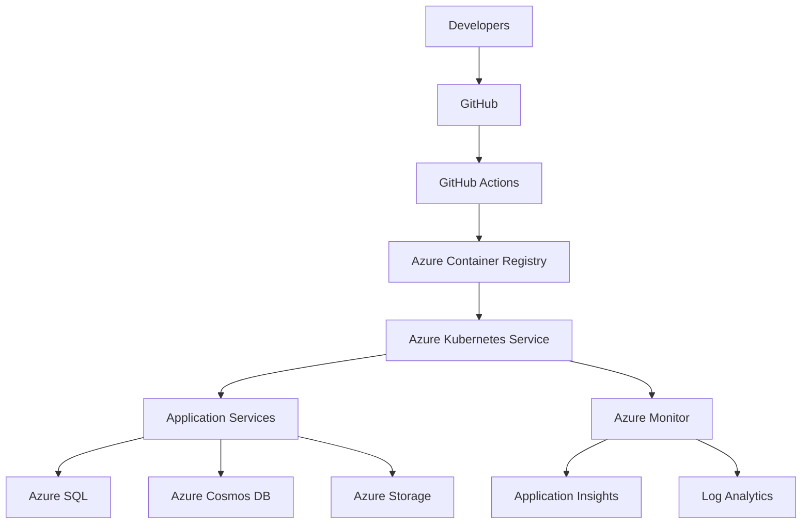
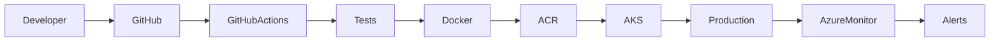

# ☁️ Fortress Cloud Infrastructure & DevOps Engineering
> **Engineering Knowledge System (EKS)**
>
> **Owner:** Esiana Emmanuel  
> **Team:** Cloud Infrastructure & DevOps  
> **Version:** 1.0.0  
> **Last Updated:** 1 July 2026

---

# Overview

Welcome to the **Fortress Cloud Infrastructure & DevOps Engineering Knowledge Base**.
The Fortress Cloud Infrastructure & DevOps Engineering Handbook is the authoritative source for designing, deploying, operating, and governing the cloud platform that powers the Fortress AI Cybersecurity Platform. It defines the engineering standards, architectural principles, operational practices, and deployment strategies that ensure Fortress remains secure, scalable, resilient, and maintainable throughout its lifecycle.

This documentation serves as the official reference for designing, deploying, securing, monitoring, and operating the cloud infrastructure that powers the Fortress AI Cybersecurity Platform.

The objective is to ensure every engineer follows the same engineering standards, architectural principles, operational procedures, and deployment workflows.

---

# Mission

Our mission is to provide a secure, scalable, resilient, and fully automated cloud platform that enables Fortress engineering teams to build and deploy AI-powered cybersecurity solutions with confidence.

---

# Engineering Principles

The Cloud Infrastructure & DevOps Team follows these guiding principles:

- Infrastructure as Code (IaC) First
- Automation Over Manual Processes
- Security by Default
- Zero Trust Architecture
- Immutable Infrastructure
- GitOps & CI/CD
- Least Privilege Access
- Everything Monitored
- Cost Awareness
- Documentation as Code

---

# Cloud Architecture



---

# Documentation Structure

```
docs/

├── README.md
│
├── cloud/
│   ├── AZURE.md
│   ├── AKS.md
│   ├── ACR.md
│   ├── NETWORKING.md
│   ├── STORAGE.md
│   ├── MONITORING.md
│   ├── BACKUP.md
│   └── DISASTER_RECOVERY.md
│
├── deployment/
│   ├── DOCKER.md
│   ├── CI_CD.md
│   ├── GITHUB_ACTIONS.md
│   ├── DEPLOYMENT.md
│   ├── ENVIRONMENTS.md
│   └── RELEASE_PROCESS.md
│
├── security/
│   ├── KEY_VAULT.md
│   ├── SECRETS.md
│   ├── RBAC.md
│   └── ZERO_TRUST.md
│
└── operations/
    ├── RUNBOOK.md
    ├── INCIDENT_RESPONSE.md
    ├── MONITORING_GUIDE.md
    └── TROUBLESHOOTING.md
```

---

# Learning Path

Cloud Infrastructure Engineers should study the documentation in the following order.

| Step | Document | Purpose |
|-------|----------|---------|
| 1 | AZURE.md | Azure architecture and governance |
| 2 | DOCKER.md | Containerization fundamentals |
| 3 | ACR.md | Container Registry |
| 4 | AKS.md | Kubernetes & orchestration |
| 5 | NETWORKING.md | Azure networking |
| 6 | STORAGE.md | Storage services |
| 7 | CI_CD.md | Continuous Integration & Deployment |
| 8 | GITHUB_ACTIONS.md | Pipeline automation |
| 9 | DEPLOYMENT.md | Deployment strategy |
|10 | MONITORING.md | Observability |
|11 | KEY_VAULT.md | Secrets management |
|12 | RUNBOOK.md | Operational procedures |

---

# Cloud Infrastructure Responsibilities

The Cloud Infrastructure & DevOps Team is responsible for:

- Azure Architecture
- Infrastructure as Code
- Kubernetes (AKS)
- Container Platform
- Azure Container Registry
- CI/CD Pipelines
- GitHub Automation
- Cloud Networking
- Azure Storage
- Azure SQL
- Cosmos DB
- Monitoring & Logging
- Security Integration
- Disaster Recovery
- Cost Optimization
- Operational Excellence

---
# Technology Decision Matrix
Technology|Purpose	|Why Selected
Microsoft Azure	|Cloud Platform|	Enterprise integration, managed services, security ecosystem
Docker|	Containerization|	Consistent application packaging across environments
Azure Kubernetes Service|	Container orchestration|Automated scaling, resilience, and managed Kubernetes
Azure Container Registry|	Image storage|	Secure, private registry integrated with AKS
GitHub Actions|	CI/CD	|Native GitHub integration and automated workflows
Azure SQL Database	|Relational data|	Managed SQL with high availability and backups
Azure Cosmos DB|NoSQL data|	Low-latency, globally distributed document storage
Azure Key Vault|	Secrets	|Centralized secret, certificate, and key management
Azure Monitor	|Observability|	Unified metrics, logs, and alerting

# Deployment Workflow



---

# Cloud Standards

Every cloud resource must adhere to the following standards.

- Infrastructure deployed using Infrastructure as Code.
- All resources tagged appropriately.
- Naming conventions enforced.
- Monitoring enabled.
- Backup configured.
- Least privilege access.
- Secrets stored in Azure Key Vault.
- CI/CD pipeline required for deployments.
- No manual production deployments.
- Documentation updated alongside infrastructure changes.

---

# Technology Stack

| Area | Technology |
|------|------------|
| Cloud | Microsoft Azure |
| Containers | Docker |
| Orchestration | Azure Kubernetes Service (AKS) |
| Registry | Azure Container Registry (ACR) |
| CI/CD | GitHub Actions |
| IaC | Bicep / Terraform |
| Database | Azure SQL |
| NoSQL | Azure Cosmos DB |
| Storage | Azure Storage |
| Secrets | Azure Key Vault |
| Monitoring | Azure Monitor |
| Logs | Log Analytics |
| Telemetry | Application Insights |

---

# Repository Standards

Every infrastructure change must:

- Be tracked in Git.
- Be reviewed through a Pull Request.
- Pass automated validation.
- Be approved by code owners.
- Follow the documented architecture.
- Include updated documentation where applicable.

---

# Related Documentation

## Cloud

- AZURE.md
- AKS.md
- ACR.md
- NETWORKING.md
- STORAGE.md
- MONITORING.md
- BACKUP.md
- DISASTER_RECOVERY.md

---

## Deployment

- DOCKER.md
- CI_CD.md
- GITHUB_ACTIONS.md
- DEPLOYMENT.md
- ENVIRONMENTS.md
- RELEASE_PROCESS.md

---

## Security

- KEY_VAULT.md
- SECRETS.md
- RBAC.md
- ZERO_TRUST.md

---

## Operations

- RUNBOOK.md
- INCIDENT_RESPONSE.md
- MONITORING_GUIDE.md
- TROUBLESHOOTING.md

---

# Contributing

Before contributing to the Cloud Infrastructure documentation:

- Follow the Engineering Knowledge System standards.
- Keep documentation versioned.
- Update architecture diagrams where necessary.
- Submit changes through Pull Requests.
- Request review from the Cloud Infrastructure & DevOps Team.

---

# Document Ownership

| Role | Responsibility |
|------|----------------|
| Cloud Infrastructure & DevOps Engineer | Infrastructure documentation |
| Platform Engineering Lead | Technical review |
| Security Team | Security validation |
| Engineering Management | Final approval |

---
# Cloud Engineering RoadMap
Phase 1
Engineering Foundation
✓ GitHub
✓ Standards
✓ Documentation

↓

Phase 2
Cloud Platform
Azure
AKS
Networking

↓

Phase 3
Automation
CI/CD
IaC
Monitoring

↓

Phase 4
Production
Security
Scaling
Disaster Recovery

↓

Phase 5
Optimization
Performance
Cost
Observability
# Engineering Philosophy
We treat infrastructure as software, automation as the default, documentation as a deliverable, security as a design principle, and reliability as a shared responsibility. Every cloud resource, deployment, and operational process should be reproducible, version-controlled, observable, and continuously improved.

# Version History

| Version | Date | Description |
|----------|------|-------------|
| 1.0.0 | July 2026 | Fortress Cloud Infrastructure & DevOps Engineering Handbook|